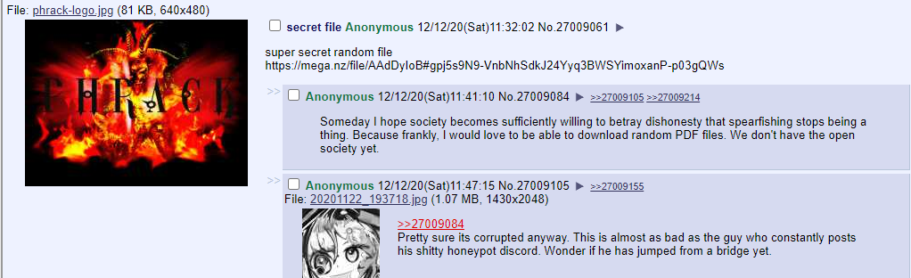

# 0x414141
**Category: OSINT / Forensics**

All we have to go off here is the challenge prompt:
> I think offshift promised to opensource some of their code

I searched GitHub to find this open source code, and came accross this Offshift repository: https://github.com/offshift-protocol/promo. The repo has [this suspicious commit](https://github.com/offshift-protocol/promo/commit/f2112c46cafb86e3225901b011e4ea71858901a3) where a `pyc` file was deleted. Let's decompile this:

```
uncompyle6 -o . script.cpython-38.pyc
```

The code decompiles as:
```python
import base64
secret = 'https://google.com'
cipher2 = [b'NDE=', b'NTM=', b'NTM=', b'NDk=', b'NTA=', b'MTIz', b'MTEw', b'MTEw', b'MzI=', b'NTE=', b'MzQ=', b'NDE=', b'NDA=', b'NTU=', b'MzY=', b'MTEx', b'NDA=', b'NTA=', b'MTEw', b'NDY=', b'MTI=', b'NDU=', b'MTE2', b'MTIw']
cipher1 = [base64.b64encode(str(ord(i) ^ 65).encode()) for i in secret]
```

Printing cipher1, we get:
```
[b'NDE=', b'NTM=', b'NTM=', b'NDk=', b'NTA=', b'MTIz', b'MTEw', b'MTEw', b'Mzg=', b'NDY=', b'NDY=', b'Mzg=', b'NDU=', b'MzY=', b'MTEx', b'MzQ=', b'NDY=', b'NDQ=']
```

We see that a cipher2 is provided. I applied the encryption in reverse by writing:
```python
result = [chr(int(base64.b64decode(i).decode())^65) for i in cipher2]
print(''.join(result))
```

It prints: https://archive.is/oMl59.

The link takes us to a place with a suspicious file:


Downloading it gives us a `smashing.pdf` file. The file cannot be opened, and seems to be very corrupted. 

Since the challenge is named `0x414141`, I knew that `0x41` would come in handy at some point. I wrote a python script to xor all the file's bytes by `0x41`:

```python
corrupted = open('smashing.pdf', 'rb')
data = corrupted.read()

new_file = open('unsmashed.pdf', 'wb')

new_file.write((''.join(chr(i ^ 0x41) for i in data)).encode('charmap'))
```

The unsmashed.pdf file can be opened. It doesn't have any flag info in it though. 

Using CyberChef we can extract any embedded files in the pdf. There is a hidden password protected zip file hidden within the pdf.

`fcrackzip` can be used to find the password. I fired it up using the `rockyou` common password list from SecLists:

```
fcrackzip -b -D -p rockyou.txt -u _unsmashed.pdf.extracted/2CFE4.zip

PASSWORD FOUND!!!!: pw == passwd
```

Putting in the password reveals the file `flag.txt` containing:
```
oh ma gawd you got it 

flag{1t_b33n_A_l0ng_w@y8742}
```
