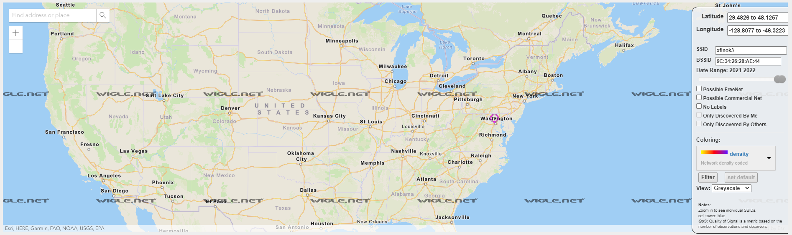
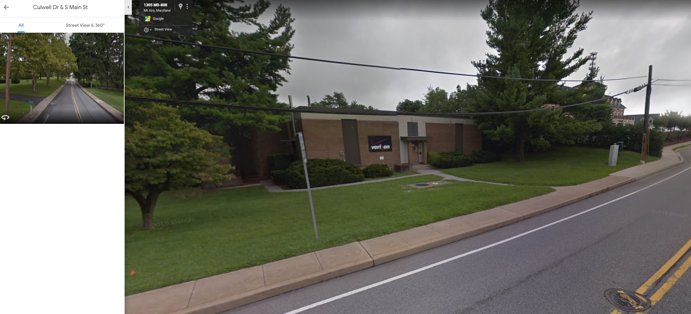

# Identifications
**Category: OSINT**

Challenge prompt:
> Hey man. I'm standing in front of this Verizon central office building. What's its CLLI code?

> What? No, I don't know where I am, my GPS is broken. I tried to connect to some Wi-Fi so I could download a map or something, but I don't know the password to any of these networks.

I looked up what CLLI meant:
> CLLI (pronounced "silly") is a Bell System acronym standing for Common Language Location Identifier. It was a standardized way of describing locations and significant pieces of hardware at those locations.

The challenge included two photos:

The last network looked pretty uniquely named. I went to https://wigle.net/ and typed in the details. It was able to highlight the geographic location of the network on a map:

Looking on Google Street View at that location, I was able to find the building:

The address is `1305 S Main St, Mt Airy, MD 21771, USA`. Next, I started to dig for the CLLI.

This site let me search for CLLI codes by zip code: https://www.telcodata.us/search-switches-by-zip-code?zip=21771. Putting in the zip from Google Maps shows:

CLLI|	LATA|	English Name|	Switch Type|	Street Address|	City|	State|	Zip
---|---|---|---|---|---|---|---
MTARMDMARS0|	240|	N/A|	WECO 5ESS Remote (5B RSM)|	MAIN ST|	MOUNT AIRY|	MD|	21771
MTARMDMARS1|	240|	MOUNT AIRY|	5ESS-EXM|	MAIN ST|	MOUNT AIRY|	MD|	21771
MTARMDSD00T|	240|	N/A|	N/A|	9625-A BROWN CHURCH RD|	MOUNT AIRY|	MD|	21771
MTARMDSDD20|	N/A|	N/A|	N/A|	9625-A BROWN CHURCH RD|	MOUNT AIRY|	MD|	21771
MTARMDSDDS0|	240|	N/A|	N/A|	9625-A BROWN CHURCH RD|	MOUNT AIRY|	MD|	21771

The one named `Mount Airy` looked like a good candidate. Submitting its CLLI (`MTARMDMARS1`) as the flag solved this challenge.

`DawgCTF{MTARMDMARS1}`