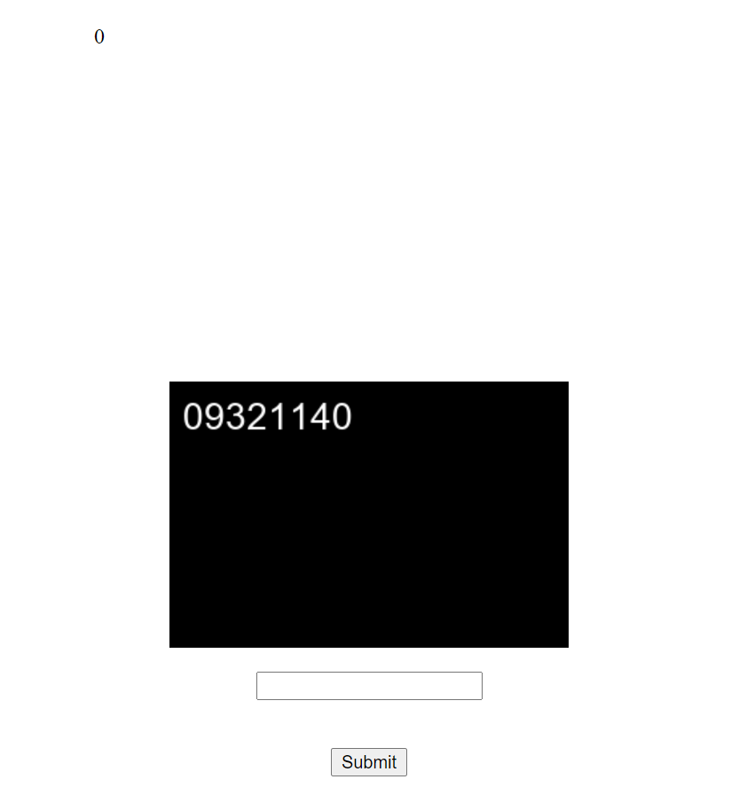

# OTP Smasher
**Category: Scripting**

The site presents an image and a textbox:

</img>

The goal here is to quickly identify the number in the image, and submit it into the box. If you can do this within a very short timespan, the point counter increments by one. Otherwise, it resets to zero. Doing this at the speed required manually isn't possible, and we'll need to script something.

Looking at the source code reveals where we can fetch the information we need:
```html

    <br>
    <form action="/" method="post">
        <input type="text" name="otp_entry" class="otp_entry">
        <br><br>
        <input type="submit" value="Submit" class="otp_entry" >
    </form>

```
The flag image just returns a 404 for now, we'll have to get a high enough score before it will reveal itself.

Below is the code to get this to work. It took some trial and error to tweak the parameters to get it to consistently recognize the characters properly:

```python
#!/usr/bin/env python3

import pytesseract
from PIL import Image
import PIL.ImageOps
import requests

URL = 'http://challenge.ctf.games:31290'

for i in range(46):
    image_request = requests.get(f'{URL}/static/otp.png', stream = True)
    with open('otp.png', 'wb') as fd:
        for chunk in image_request.iter_content(chunk_size=128):
            fd.write(chunk)
    image = Image.open('otp.png')
    # Preprocess the image by converting it from white text on black, to black text on white. 
    # (Provides more accurate recognition.)
    inverted_image = PIL.ImageOps.invert(image)
    inverted_image.save('otp-inverted.png')

    # Perform optical character recognition
    # Configuration:
    # -psm 6 : Set analysis mode to assume a single uniform block of text
    # -oem 3 : Use default OCR Engine mode
    # -l eng : Recognize English character set
    # -c tessedit_char_whitelist=0123456789 : Only recognize digits
    code = pytesseract.image_to_string(
             Image.open('otp-inverted.png'), 
             config='--psm 6 --oem 3 -l eng -c tessedit_char_whitelist=0123456789'
           ).strip()
    print(code)

    post = requests.post(URL, data={'otp_entry': code})
    print(post.text)


# Download the flag
image = requests.get(f'{URL}/static/flag.png', stream = True)
assert(image.status_code == 200)

with open('flag.png', 'wb') as fd:
    for chunk in image.iter_content(chunk_size=128):
        fd.write(chunk)

# flag{f994cd9c756675b743b10c44b32e36b6}
```
