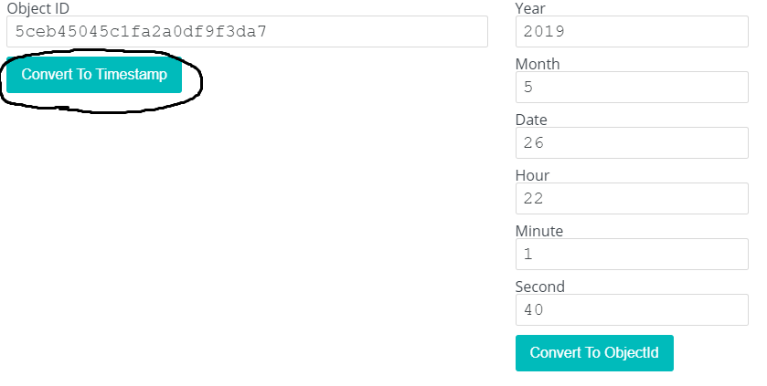
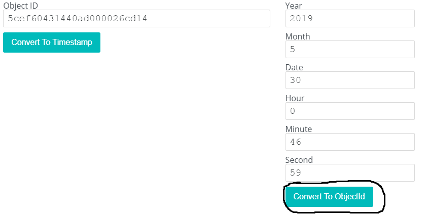

# Objects
**Category: Web**

The site returns a page that says "Hi" and nothing else. We can open `/robots.txt` to find some endpoints.

`/robots.txt`
```
User-agent: Google
Disallow: /ajax/
Disallow: /album.php
Disallow: /l0g.hacker
Disallow: /index.php~
```

Let's look at some of these:


`/l0g.hacker`
```
Mon May 27 2019 10:01:40 GMT+0800 (UTC)   Start service
Mon May 27 2019 13:24:45 GMT+0800 (UTC)   Start database
Sat May 20 2019 22:53:32 GMT+0800 (UTC)   Start Updated
Fri May 30 2019 12:46:59 GMT+0800 (UTC)   Flag Added Here
```

`/index.php~`
```
<?php

if ( $_GET['flag_id'] == $flagid ){ echo $flag; }
 

/*

u need to get the flag ID, and use this ids ;)

IDs:
5ceb45045c1fa2a0df9f3da7
5ceb749d5c1fa2a0df9f3da8
5ce2bf6c5c1fa2a0df9f3da9

i love mongo remember that.

*/
```
This file is showing the source of `index.php`. We need to call the page with the correct `flag_id` to see the flag. We can also see some other existing IDs in the system.

I looked into the Mongo documentation to see how the IDs get generated:
> ObjectIds are small, likely unique, fast to generate, and ordered. ObjectId values are 12 bytes in length, consisting of:

> a 4-byte timestamp value, representing the ObjectId's creation, measured in seconds since the Unix epoch

> a 5-byte random value

> a 3-byte incrementing counter, initialized to a random value

I used [this site](https://www.toolswow.com/generator/mongo-objectid-timestamp-converter) to try and convert the first provided ID (`5ceb45045c1fa2a0df9f3da7`) to a date.



The minute and seconds line up with the first timestamp in the log file. It looks like due to time zone differences the time shown in the log file is 12 hours ahead of the time in the ID.

Keeping that in mind, lets generate the hex timestamp using the time of the "Flag Added Here" log:



The first 4 bytes are the timestamp value. We can pluck `5cef6043` as our prefix.

Next, the 5 byte random value. It is identical in all our example IDs: `5c1fa2a0df`.

Finally, the 3 byte incremented value. We can see the other IDs have `9f3da7`, `9f3da8`, and `9f3da9`, which means the next iteration is `9f3daa`.

Putting it all together, our ID is `5cef60435c1fa2a0df9f3daa`.

Requesting `GET /index.php?flag_id=5cef60435c1fa2a0df9f3daa` returns our flag:
```
FLAG{0bj3ct_Id$_!s_w0Nd3rFul}
```